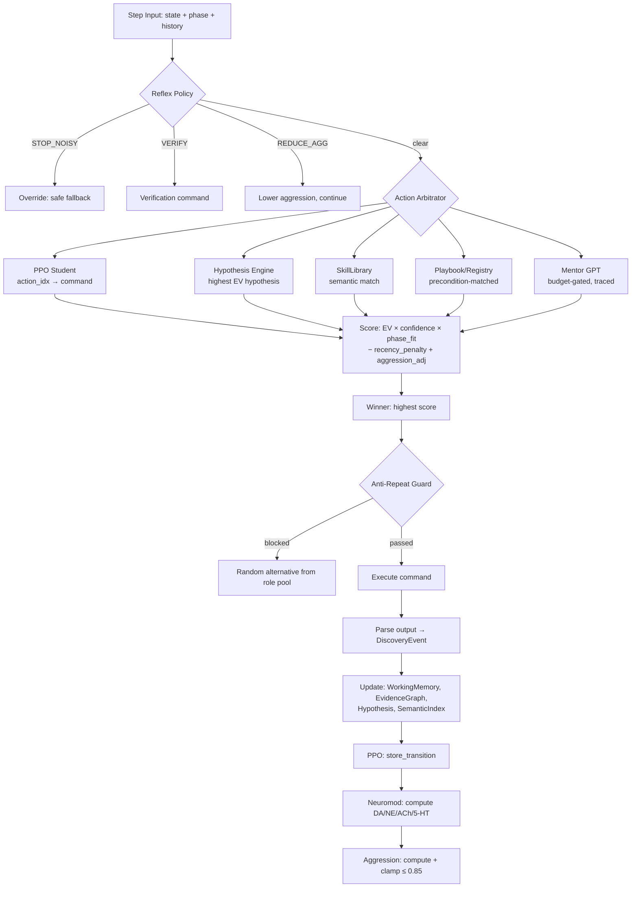
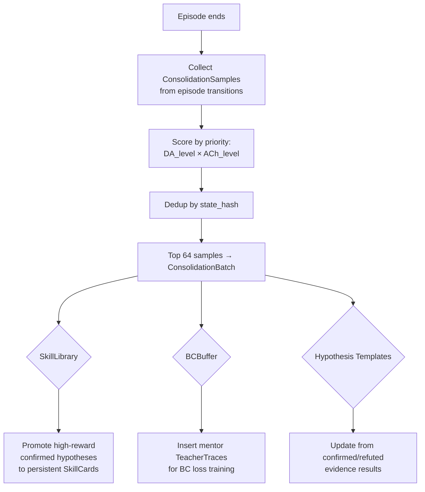

<p align="center">
  
  
  
  
  
  
</p>

<br>

```
     █████╗ ██████╗ ██╗ █████╗ ███████╗██╗  ██╗ █████╗
    ██╔══██╗██╔══██╗██║██╔══██╗██╔════╝██║ ██╔╝██╔══██╗
    ███████║██████╔╝██║███████║███████╗█████╔╝ ███████║
    ██╔══██║██╔══██╗██║██╔══██║╚════██║██╔═██╗ ██╔══██║
    ██║  ██║██║  ██║██║██║  ██║███████║██║  ██╗██║  ██║
    ╚═╝  ╚═╝╚═╝  ╚═╝╚═╝╚═╝  ╚═╝╚══════╝╚═╝  ╚═╝╚═╝  ╚═╝
            ██████╗ ██╗
            ██╔══██╗██║           NEUROVORTEX
            ██████╔╝██║           Autonomous Multi-Agent
            ██╔══██╗██║           Reinforcement Learning for
            ██║  ██║███████╗      Cybersecurity Simulation
            ╚═╝  ╚═╝╚══════╝      by Filip Volf
```

<p align="center">
  <strong>5 Agents · 6-Source Arbitrated Pipeline · Neuromodulator-Driven Exploration · 107K Knowledge Entries · 875 Tests</strong>
</p>

---

## Why This Matters

Penetration testing is manual, expensive, and doesn't scale. Ariaska replaces the "next command" guesswork with an RL-trained decision engine that learns from every step — which exploits work, which fail, and why.

The system doesn't just pick actions. It **reasons**: builds evidence graphs, forms hypotheses about what services are vulnerable, tests them, and consolidates winning strategies into reusable skills. A biologically-inspired neuromodulator system (Phase 15 — Neurovortex) dynamically adjusts exploration, aggression, and learning rate based on real-time signals — dopamine for reward prediction error, norepinephrine for surprise, acetylcholine for attention, serotonin for patience.

Every LLM call is budget-gated, cached, and ROI-tagged. The mentor (GPT) teaches but never drives — the PPO student must predict first, and the gap between student and teacher becomes the training signal (TeacherTrace behavioral cloning).

```
┌──────────────────────────────────────────────────────────────────────┐
│                        ARIASKA_RL  NEUROVORTEX                       │
│                                                                      │
│   101,000+ lines of core Python   ·    201 modules                   │
│   875 tests (all passing)         ·    51 test files                 │
│   107,933 knowledge entries       ·    11 search indices             │
│   5 specialized agents            ·    144+ command templates        │
│   7 kill chain phases             ·    51 feature flags              │
│   4 neuromodulators               ·    6-source action arbitrator    │
│   Budget-gated LLM (877K tokens)  ·    877,500 token/episode cap     │
│                                                                      │
│   Primary Target:  HTB / Metasploitable via Docker                   │
│   Entry Point:     ariaska_cli.py → SmartOrchestrator                │
│   Python:          3.11+ (developed on 3.13.7)                       │
└──────────────────────────────────────────────────────────────────────┘
```

---

## What Makes It Different

| Feature | Ariaska Neurovortex | Typical RL Pentest Agent |
|---------|---------------------|--------------------------|
| Decision source | 6-source arbitrated pipeline (PPO, hypothesis, skill, playbook, registry, mentor) | Single-policy or scripted |
| Mentor control | Autonomy-scheduled, declining over time, every call traced | Unbounded LLM calls |
| LLM budget | Per-episode, per-tier, ROI-tagged, cached | Unlimited or hopes-and-prayers |
| Knowledge | 107K indexed entries (by port, CVE, service, phase, killchain) | Ad-hoc prompts |
| Memory | Working memory + semantic index + consolidation ("sleep replay") | Flat replay buffer |
| Exploration | Neuromodulator-driven (DA/NE/ACh/5-HT → entropy, LR, aggression) | Fixed epsilon |
| Safety | Reflex policy + detection clamp + brute-force guard + aggression ceiling | None or minimal |
| Multi-agent | 5 specialized agents with phase-dependent activation | Monolithic agent |

---

## Table of Contents

- [Why This Matters](#why-this-matters)
- [What Makes It Different](#what-makes-it-different)
- [Neurovortex Architecture](#neurovortex-architecture-phase-15)
- [Decision Pipeline](#decision-pipeline)
- [Neuromodulator System](#neuromodulator-system)
- [Budget + ROI Enforcement](#budget--roi-enforcement)
- [Consolidation Loop](#consolidation-loop-sleep-replay)
- [The Five Agents](#the-five-agents)
- [Kill Chain Simulation](#kill-chain-simulation)
- [Knowledge System](#knowledge-system)
- [PPO — Primary RL Algorithm](#ppo--primary-rl-algorithm)
- [Safety Boundary](#safety-boundary)
- [How to Run](#how-to-run)
- [Feature Flag Profiles](#feature-flag-profiles)
- [Benchmarks / KPIs](#benchmarks--kpis)
- [Testing](#testing)
- [Project Structure](#project-structure)
- [Roadmap](#roadmap-phase-16)
- [Author](#author)
- [License](#license)

---

## Neurovortex Architecture (Phase 15)

```
┌─────────────────────────────────────────────────────────────────────┐
│                        SmartOrchestrator                            │
│   ┌───────────┐  ┌───────────┐  ┌───────────┐  ┌────────────────┐  │
│   │ScoutAgent │  │ RedAgent  │  │ShadowAgent│  │  OrionAgent    │  │
│   │  (recon)  │  │ (exploit) │  │ (stealth) │  │  (strategy)    │  │
│   └─────┬─────┘  └─────┬─────┘  └─────┬─────┘  └──────┬────────┘  │
│         └───────────────┼──────────────┼───────────────┘            │
│                         ▼                                           │
│                ┌─────────────────┐                                  │
│                │   SmartCoach    │  ← one per agent, 7.7K lines     │
│                │                 │                                  │
│                │  ┌───────────┐  │    ┌──────────────────────────┐  │
│                │  │ Neuromod  │──┼───▶│ DA · NE · ACh · 5-HT    │  │
│                │  │ Engine    │  │    │ → entropy, LR, BC, agg   │  │
│                │  └───────────┘  │    └──────────────────────────┘  │
│                │  ┌───────────┐  │    ┌──────────────────────────┐  │
│                │  │  Reflex   │──┼───▶│ detection > 0.7? STOP    │  │
│                │  │  Policy   │  │    │ brute > 10? HALT         │  │
│                │  └───────────┘  │    └──────────────────────────┘  │
│                │  ┌───────────┐  │    ┌──────────────────────────┐  │
│                │  │Arbitrator │──┼───▶│ PPO·Hyp·Skill·Reg·Mentor│  │
│                │  │           │  │    │ score → pick best        │  │
│                │  └───────────┘  │    └──────────────────────────┘  │
│                │  ┌───────────┐  │    ┌──────────────────────────┐  │
│                │  │ Working   │──┼───▶│ phase · evidence · disc  │  │
│                │  │ Memory    │  │    │ TTL slots, to_vector()   │  │
│                │  └───────────┘  │    └──────────────────────────┘  │
│                │  ┌───────────┐  │    ┌──────────────────────────┐  │
│                │  │ Sensory   │──┼───▶│ ring buffer of obs       │  │
│                │  │ Buffer    │  │    │ feeds neuromod inputs    │  │
│                │  └───────────┘  │    └──────────────────────────┘  │
│                └─────────────────┘                                  │
│                         │                                           │
│                         ▼  (end of episode)                         │
│                ┌─────────────────┐                                  │
│                │ Consolidation   │  "Sleep replay"                  │
│                │ Engine          │  DA × ACh priority scoring       │
│                │ → SkillLibrary  │  dedup by state hash             │
│                │ → BCBuffer      │  bounded 64 samples              │
│                └─────────────────┘                                  │
└─────────────────────────────────────────────────────────────────────┘
```

---

## Decision Pipeline

Each agent's SmartCoach selects commands through a **6-source arbitrated pipeline**:



**Decision source tracking** — every step logs its source: `ppo` | `hypothesis` | `skill_library` | `playbook` | `registry` | `mentor` | `anti_repeat` | `fallback` | `reflex_override`

---

## Neuromodulator System

Four modulators map to control-theory variables that adjust agent behavior in real-time:

| Modulator | Biological Analogy | Control Signal | Effect |
|-----------|-------------------|----------------|--------|
| **Dopamine (DA)** | Reward prediction error | `entropy_bonus` | High DA → more exploration after positive surprise |
| **Norepinephrine (NE)** | Arousal / alertness | `learning_rate_mod` | High NE → faster learning, BUT clamped at 0.75 |
| **Acetylcholine (ACh)** | Attention / focus | `bc_weight` | High ACh → stronger behavioral cloning from mentor |
| **Serotonin (5-HT)** | Patience / impulse control | `aggression` | Low 5-HT → more aggressive (less patient) |

**Inputs** (fed from SensoryBuffer ring buffer each step):
- `reward_delta` → DA (was reward better/worse than expected?)
- `novelty` → NE (is this observation new?)
- `mentor_active` → ACh (is the mentor teaching right now?)
- `detection_risk` → 5-HT (how close are we to getting caught?)

**Aggression controller** — HTB-calibrated:
- Phase baselines: RECON=0.35, ENUM=0.45, EXPLOIT=0.65, PRIVESC=0.75
- Hard ceiling: 0.85 (never over-commits)
- NE spike guard: if NE > 0.75, clamp aggression
- Detection hard clamp: if detection_risk > 0.7, override to 0.3

---

## Budget + ROI Enforcement

Every LLM call must pass three gates: **budget available**, **cache miss**, and **ROI tag present**.

| Tier | Model | Budget | Share | Use Case |
|------|-------|--------|-------|----------|
| `codex` | gpt-5.2-codex | 263,250 | 30% | Orion strategic plans, postmortem, mentor reasoning |
| `full` | gpt-5.2 | 175,500 | 20% | Plan verification, invariant checks |
| `mini` | gpt-5.2-mini | 263,250 | 30% | Hypothesis ranking, verification, lesson compression |
| `nano` | gpt-5.2-nano | 175,500 | 20% | Micro classification, cache-key summaries |
| **Total** | | **877,500** | 100% | **1.5× base allocation per episode** |

**15 valid ROI tags** — every call must justify its existence:
`classification` · `verification` · `consolidation` · `strategy_plan` · `mentor_teacher` · `parsing` · `tactical_advice` · `reward_shaping` · `postmortem` · `reflex_microtask` · `improves_hypothesis_accuracy` · `reduces_steps_to_foothold` · `reduces_steps_to_root` · `reduces_mentor_reliance` · `increases_chain_coherence`

**If budget exhausted or ROI tag missing → deterministic fallback, no LLM call.**

---

## Consolidation Loop ("Sleep Replay")

At the end of each episode, the consolidation engine distills experience into persistent knowledge:



**What this means**: the agent doesn't just forget after each episode. High-value experiences (scored by dopamine × attention) survive as reusable **skills** and **behavioral cloning targets** for future episodes.

---

## The Five Agents

| Agent | Role | Domain |
|-------|------|--------|
| 🔴 **RedAgent** | Offensive | Exploitation, privilege escalation, exfiltration. Primary PPO-trained. DQN+GPT hybrid with emergency fallbacks. |
| 🔵 **BlueAgent** | Defensive | Honeypots, credential resets, firewall rules, alert management. Reactive to RedAgent actions. |
| 🟢 **ScoutAgent** | Recon | Network discovery, port scanning, service fingerprinting, version detection. |
| 🟣 **ShadowAgent** | Stealth | Alert monitoring, scan timing randomization, detection avoidance, action overrides. |
| 🟡 **OrionAgent** | Strategic | Coordination, strategic reviews, cross-agent directives, phase transitions. |

**Phase-dependent activation order:**

```
RECON:        Scout → Shadow → Orion → Red → Blue
EXPLOITATION: Red → Shadow → Scout → Orion → Blue
EXFILTRATION: Red → Shadow → Orion → Scout → Blue
```

Each agent implements `AgentInterface` + `MemorySyncInterface` and has its own `SmartCoach` with independent neuromodulator state, working memory, and consolidation pipeline.

---

## Kill Chain Simulation

```
RECON → ENUMERATION → EXPLOITATION → PRIVILEGE_ESCALATION →
LATERAL_MOVEMENT → POST_EXPLOITATION → EXFILTRATION
```

The `CyberEnvironment` (2,854 lines) simulates the full kill chain with phase-gated progression. Rewards escalate from RECON (1.0) through EXFILTRATION (250.0).

**Discovery bonuses:**

| Discovery | Reward |
|-----------|--------|
| Open port | 2.5 |
| Service identified | 5.0 |
| Version detected | 6.5 |
| Credential found | 20.0 |
| Password cracked | 26.0 |
| Shell obtained | 50.0 |
| Root shell | 130.0 |
| Flag captured | 200.0 |

**Primary targets:**

| Port | Service | Vulnerability | Exploit Path |
|------|---------|---------------|--------------|
| 21 | vsftpd 2.3.4 | Backdoor | `exploit/unix/ftp/vsftpd_234_backdoor` → root |
| 139/445 | Samba 3.0.20 | CVE-2007-2447 | `exploit/multi/samba/usermap_script` → root |
| 1524 | ingreslock | Backdoor | `telnet <target> 1524` → instant root |
| 6667 | UnrealIRCd | Backdoor | `exploit/unix/irc/unreal_ircd_3281_backdoor` → root |
| 8180 | Tomcat | Default creds | `tomcat:tomcat` → WAR deploy → shell |

---

## Knowledge System

**107,933 entries** across 18 JSONL partitions with **11 prebuilt indices**.

| Source | Entries |
|--------|---------|
| ExploitDB | 46,491 |
| CVEs | 25,467 |
| Commands | 24,342 |
| Wordlists | 5,814 |
| Other (14 files) | 5,819 |

**Indices:** `by_port` (417 keys) · `by_cve` (25K) · `by_service` (193) · `by_phase` (8) · `by_tag` (71K) · `by_template` (205) · `by_platform` (79) · `by_killchain` (6) · `by_vuln_family` (19) · `by_exploit_archetype` (13) · `by_origin` (20)

Each entry follows the `KnowledgeCandidate` v2 schema (14 nested dataclasses) with taxonomy, evidence gates, execution templates, references, and quality metrics.

---

## PPO — Primary RL Algorithm

**1,541 lines** with R68–R80 advanced features:

| Feature | Description |
|---------|-------------|
| Phase-gated actor heads | HRL-lite: recon/exploit/post-exploit head groups |
| Self-Imitation Learning | 500-entry SIL buffer for positive-advantage replay |
| Symlog value compression | DreamerV3-style value scaling |
| Cosine entropy schedule | With rebound for re-exploration |
| Dual-horizon GAE | λ=0.97 long + λ=0.70 short, blended at 0.65 |
| KL-adaptive learning rate | 3e-4 → 1e-5 based on policy divergence |
| Spectral normalization | On critic for training stability |
| EMA target network | τ=0.995 with value-surprise intrinsic bonus |
| Auxiliary phase prediction | Multi-task head predicting current kill chain phase |

**State encoder:** 512-dimensional vector encoding phase, state flags, port presence, service types, numeric features, action history, LLM features, and temporal features.

**Key hyperparameters:**

| Parameter | Value |
|-----------|-------|
| State dim | 512 |
| Action dim | 5 |
| Hidden dims | [512, 512, 256] |
| PPO clip | 0.2 (adaptive 0.15–0.25) |
| Learning rate | 3e-4 → 1e-5 (KL-adaptive) |
| GAE λ | 0.97 (dual: +0.70 short) |
| Discount γ | 0.99 |
| Steps/episode | 40 |
| Rollout size | 256 |

---

## Safety Boundary

**Ariaska operates exclusively against authorized lab targets.**

```
┌── RFC1918 Enforcement ─────────────────────────────────────────┐
│   RealToolRunner validates all target IPs are private          │
│   10.0.0.0/8 · 172.16.0.0/12 · 192.168.0.0/16               │
├── Reflex Policy ───────────────────────────────────────────────┤
│   detection_risk > 0.7  →  STOP_NOISY override               │
│   brute_force > 10      →  HALT (hard cap)                    │
│   brute + high aggression → REDUCE_AGGRESSION                 │
├── Aggression Ceiling ──────────────────────────────────────────┤
│   Hard cap: 0.85 — system never over-commits                  │
│   NE spike guard: NE > 0.75 → clamp aggression               │
├── Execution Safety ────────────────────────────────────────────┤
│   ARIASKA_DRY_RUN=1 → no real commands executed               │
│   sudo_mode="prompt" → privilege escalation requires gating   │
│   StubToolRunner in tests → zero real command execution        │
│   Sandboxed executor → additional safety layer for live runs   │
├── LLM Safety ──────────────────────────────────────────────────┤
│   All LLM outputs sanitized before command use                 │
│   No hardcoded API keys — .env + python-dotenv                │
│   Budget ceiling prevents runaway LLM costs                    │
└────────────────────────────────────────────────────────────────┘
```

---

## How to Run

### Prerequisites

- Python 3.11+ (developed on 3.13.7)
- PyTorch 2.0+
- Docker (for Metasploitable targets)
- OpenAI API key (optional — system runs in offline mode without it)

### Quick Start

```bash
# Setup
git clone <repo> && cd Ariaska_RL
make venv                       # Create virtualenv + install deps

# Simulated training (no network, no LLM needed)
python ariaska_cli.py smart-train --episodes 100 --steps 40 --seed 42 --env sim

# Quick smoke test (3 episodes, deterministic)
make smoke

# Full test suite (875 tests, ~3 min)
make test
```

### HTB Lab Mode

```bash
# Activate all 51 feature flags for HTB
source scripts/activate_htb_flags.sh
export OPENAI_API_KEY=sk-...

# Run against authorized lab target
python ariaska_cli.py smart-train --env msf --target 10.10.10.X --episodes 50

# Verify flag activation
python scripts/verify_flags.py          # 51-flag ledger
python scripts/validate_activation.py   # Full system validation
```

### Makefile Shortcuts

```bash
make venv          # Create virtualenv
make train         # Standard training
make train-quick   # 10 episodes with metrics
make train-msf     # Metasploitable Docker
make smoke         # 3-episode smoke test
make test          # Full 875-test suite
make last          # Show last run results
make clean         # Clean artifacts
```

---

## Feature Flag Profiles

51 flags across Phases 9.5–15.0. All default to safe (OFF) values.

| Profile | Use Case | Active Flags | How to Activate |
|---------|----------|--------------|-----------------|
| **OFFLINE** | No API key, simulation only | P14/P15 ON, LLM OFF | Default behavior |
| **DETERMINISTIC** | pytest / CI | All LLM OFF, dry run | `ARIASKA_DRY_RUN=1` |
| **CLOUD** | Live training with LLM | LLM ON, budget enforced | Set `OPENAI_API_KEY` |
| **HTB** | Authorized lab engagement | 48/51 ON, MS2/MS3 OFF | `source scripts/activate_htb_flags.sh` |

The 3 flags kept OFF in HTB mode: `ms2_knowledge_pack`, `ms3_knowledge_pack`, `ms2_simulated_output` — these are target-specific knowledge packs that would bias the agent toward known Metasploitable vulnerabilities.

---

## Benchmarks / KPIs

**Reward-invariant metrics** — these measure real learning quality independent of reward scaling:

| Metric | Description | Early (ep 1) | Mid (ep 25) | Mature (ep 50) |
|--------|-------------|:----------:|:---------:|:------------:|
| `unique_commands` | Distinct commands per episode | 8 | 18 | 25 |
| `diversity_ratio` | unique / total steps | 0.20 | 0.45 | 0.63 |
| `total_discoveries` | New findings per episode | 3 | 12 | 22 |
| `step_at_first_exploit` | Steps to first exploit | 35 | 18 | 8 |
| `mentor_call_rate` | Mentor calls / decisions | 0.40 | 0.22 | 0.10 |
| `autonomy_score` | AutonomyScheduler metric | 0.15 | 0.50 | 0.78 |
| `budget_pressure` | Token usage / ceiling | 0.05 | 0.35 | 0.60 |

**Target KPIs for a trained agent:**
- `diversity_ratio` > 0.6
- `mentor_call_rate` < 0.15
- `autonomy_score` > 0.7
- `budget_pressure` < 0.8
- `step_at_first_exploit` < 10

---

## Testing

**875 tests** across **51 test files**. All passing.

```bash
make test                        # Full suite (~3 min)
make smoke                       # Quick 3-episode smoke
pytest tests/ -v --tb=short      # Direct pytest
```

**Test isolation:** `tests/conftest.py` provides an autouse fixture that strips all `FF_*` environment variables before each test, ensuring tests run with default flag states regardless of ambient environment.

**Test infrastructure:**
- `FakeGPTManager(seed=N)` — deterministic LLM responses, token tracking, request history
- `StubToolRunner` — tracks commands without execution
- `RealToolRunner` — RFC1918 allowlist, blocked commands, IP validation
- `ToolResult` — structured output with stdout, stderr, return_code, timed_out

---

## Project Structure

```
ariaska_cli.py                    # CLI entry point
core/                             # 201 modules, 101K lines
├── agents/                       # 5 agents (Red, Blue, Scout, Shadow, Orion)
├── algorithms/                   # PPO (1541L), SAC, DDQN, RND, replay buffers
├── neuro/                        # Neuromodulators, aggression controller, sensory buffer
├── neurorouter/                  # Reflex policy, action arbitrator, working memory
├── memory/                       # Semantic index, hybrid memory, cognitive bus
├── training/                     # SmartCoach (7.7K lines), consolidation engine
├── orchestration/                # SmartOrchestrator (6.2K lines)
├── knowledge/                    # KG manager, playbooks, target profiler
├── llm/                          # GPTManager, BudgetManagerV2, CallCache, mentor
├── execution/                    # Parser broker (4-stage), live/sandboxed executor
├── environment/                  # CyberEnvironment (2.8K lines), kill chain
├── models/                       # State encoder (512-dim), policy net, value net
├── commands/                     # 144+ command templates by attack phase
├── telemetry/                    # JSONL structured logging, P15 telemetry
├── cortex/                       # Executive + tactical decision making
├── multiagent/                   # Agent manager, memory router, directives
└── postmortem/                   # GPT end-of-run analysis, skill library
data/                             # 107K knowledge corpus + 11 indices (~300MB)
tests/                            # 51 test files, 875 tests
scripts/                          # Flag activation, index build, validation
```

---

## Roadmap (Phase 16+)

- **Progress Estimator** — cheap model predicting "probability we're closer to foothold now than N steps ago" (proprioception for RL)
- **Multi-Target Campaigns** — pivot between hosts, lateral movement memory
- **Transfer Learning** — pre-trained weights from simulation → live HTB
- **Curriculum Scheduling** — automatic difficulty progression across HTB tiers
- **Distributed Training** — parallel episode rollouts across target farm
- **Defense-Aware Red** — BlueAgent adversarial co-training
- **Prompt Distillation** — compress mentor knowledge into smaller local models
- **Real-Time Dashboard** — Textual TUI with live neuromodulator visualization

---

## Author

**Filip Volf** — Design, architecture, and implementation.

---

## License

**Source Available — Non-Commercial Use Only**

Copyright (c) 2024-2026 Filip Volf. All rights reserved.

This software is available for viewing, study, and non-commercial use. Commercial use, SaaS deployment, and redistribution for profit require a separate license. See [LICENSE](LICENSE) for full terms.

Academic researchers and students may use this software freely for coursework, published research (with citation), and university CTF competitions.

---

<p align="center">
  <sub>Phase 15 Neurovortex — where reinforcement learning meets neuroscience-inspired control theory. 101K+ lines. Every line intentional.</sub>
</p>
