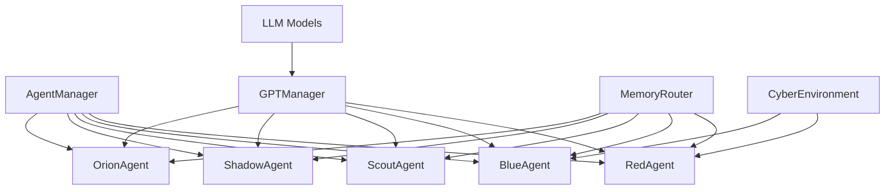

# 🧠 ARIASKA_RL


## Next-Generation GPT-Augmented Multi-Agent RL Cybersecurity Platform

ARIASKA_RL is a cutting-edge cybersecurity training platform that combines reinforcement learning with GPT models to create an advanced, autonomous red team training system. The platform features multiple specialized AI agents working in concert to simulate realistic cyber offensive and defensive scenarios.

### 🌟 Core Features

- **Multi-Agent Intelligence System**
  - `RedAgent`: Offensive security specialist
  - `BlueAgent`: Defensive operations and alerting
  - `ScoutAgent`: Situational awareness and phase navigation
  - `ShadowAgent`: Memory optimization and exploration
  - `OrionAgent`: Strategic oversight and agent coordination

- **Advanced LLM Integration**
  - Centralized GPT orchestration through `GPTManager`
  - Automatic model selection and fallback mechanisms
  - Token usage tracking and prompt optimization
  - Seamless integration with local and cloud LLMs

- **Dual-Mode Environment**
  - `Simulated`: Safe training in virtual environments
  - `Live`: Integration with real CTF/lab environments (with safety controls)
  - Domain randomization for enhanced generalization

- **Rich Memory Architecture**
  - Prioritized experience replay with SQLite persistence
  - Vector databases for semantic memory retrieval
  - Hierarchical episode and strategic memory

- **Real-Time Visualization**
  - Rich CLI dashboard with live training stats
  - Optional Streamlit web dashboard
  - Detailed performance analytics

### 🚀 Quick Start

1. **Setup Environment**

```bash
# Clone repository
git clone https://github.com/your-username/Ariaska_RL.git
cd Ariaska_RL

# Create and activate virtual environment
python -m venv venv
source venv/bin/activate  # On Windows: venv\Scripts\activate

# Install dependencies
pip install -r requirements.txt

# Configure environment
cp .env.example .env
# Edit .env with your API keys and preferences
```

2. **Run Training**

```bash
# Start basic training (100 episodes)
python main.py --train

# Start training with custom parameters
python main.py --train --episodes 50 --steps 30 --verbosity verbose

# Test environment setup
python main.py --test-env

# Launch visualization dashboard
python main.py --ui
```

3. **Docker Deployment**

```bash
# Build and run with Docker Compose
docker-compose build
docker-compose up -d

# Run with Streamlit UI
docker-compose --profile with-ui up -d
```

### 📊 Architecture



### 🧩 Core Components

- **AgentManager**: Orchestrates interaction between all agents
- **GPTManager**: Centralizes LLM requests with caching and fallback
- **MemoryRouter**: Global memory sharing and synchronization
- **CyberEnvironment**: Simulated or live attack environment
- **Trainer**: Reinforcement learning training loop
- **ValueNet/PolicyNet**: Core learning models
- **ReplayBuffer**: Prioritized experience storage
- **TrainingVisualizer**: Real-time training visualization

### 📚 Documentation

For detailed documentation, please see the `/docs` directory.

### 🔧 Development

- **Code Style**: Follow PEP 8 guidelines
- **Testing**: Run unit tests with `pytest tests/`
- **CI/CD**: GitHub Actions workflows in `.github/workflows/`

### 📄 License

This project is licensed under the MIT License - see the LICENSE file for details.

### 👥 Contributing

Contributions are welcome! Please feel free to submit a Pull Request.