<p align="center">
  
  
  
  
  
  
  
</p>

<h1 align="center">
  🔱 ARIASKA_RL
</h1>

<h3 align="center">
  <em>Autonomous Multi-Agent Reinforcement Learning System for Live Authorized Penetration Testing</em>
</h3>

<p align="center">
  5 specialized AI agents · GPT-5.2 hybrid decision pipeline · PPO Actor-Critic v3.0 · 107K knowledge corpus · ~160K lines of Python
</p>

---

## Table of Contents

- [Overview](#overview)
- [System Architecture](#system-architecture)
- [The Five Agents](#the-five-agents)
- [Decision Pipeline — SmartCoach](#decision-pipeline--smartcoach)
- [PPO — Primary RL Algorithm](#ppo--primary-rl-algorithm)
- [State Representation](#state-representation)
- [Kill Chain & Environment](#kill-chain--environment)
- [Intelligence Layers](#intelligence-layers)
  - [MicroChain](#microchain-phase-27)
  - [PhaseGuidedLLM](#phaseguidedllm-phase-34)
  - [LLM Policy Bridge](#llm-policy-bridge-phase-37)
  - [Evidence Gate](#evidence-gate)
- [Distillation Pipeline](#distillation-pipeline)
- [Knowledge System](#knowledge-system-v2)
- [Token Budget Management](#token-budget-management)
- [Reward Architecture](#reward-architecture)
- [OpsHub — Operational Authority](#opshub--operational-authority-phase-38)
- [Observability & Dashboard](#observability--dashboard)
- [Feature Flag System](#feature-flag-system)
- [Command Registry](#command-registry)
- [Memory Architecture](#memory-architecture)
- [Safety & Scope Controls](#safety--scope-controls)
- [Project Statistics](#project-statistics)
- [Getting Started](#getting-started)
- [CLI Reference](#cli-reference)
- [Testing](#testing)
- [Configuration Reference](#configuration-reference)
- [Phase History](#phase-history)

---

## Overview

**Ariaska_RL** is a production-grade autonomous penetration testing system that combines deep reinforcement learning with large language model reasoning to conduct live, authorized security assessments. The system deploys five cooperating AI agents — each with a distinct tactical role — through an eight-stage cyber kill chain, making real-time decisions about reconnaissance, exploitation, privilege escalation, lateral movement, and exfiltration.

Unlike traditional automated scanners that follow rigid scripts, Ariaska learns and adapts. Its PPO Actor-Critic v3.0 policy network learns from every engagement, while a tiered GPT-5.2 hybrid pipeline provides strategic reasoning, command validation, and distillation signals that accelerate the RL agent's convergence. The system has been refined over **43 development phases** into a deeply integrated cognitive architecture spanning 160K+ lines of Python across 340+ modules.

### Core Design Principles

| Principle | Implementation |
|-----------|---------------|
| **Learn, don't script** | PPO policy trained via shaped rewards from real engagement outcomes |
| **Reason, don't guess** | 3-stage MicroChain + PhaseGuidedLLM validate every exploit attempt |
| **Cooperate, don't conflict** | 5 agents with distinct roles, shared discovery board, memory sync |
| **Budget, don't burn** | BudgetManagerV2 with tiered token allocation and burst pooling |
| **Validate, don't trust** | Evidence Gate enforces exploit preconditions before execution |
| **Observe, don't assume** | Rich terminal dashboard with real-time telemetry and trace logging |

---

## System Architecture

### High-Level Data Flow

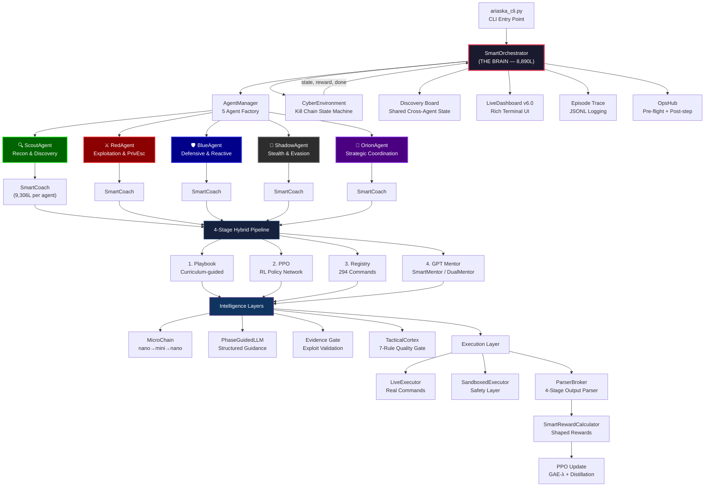

### Module Dependency Architecture

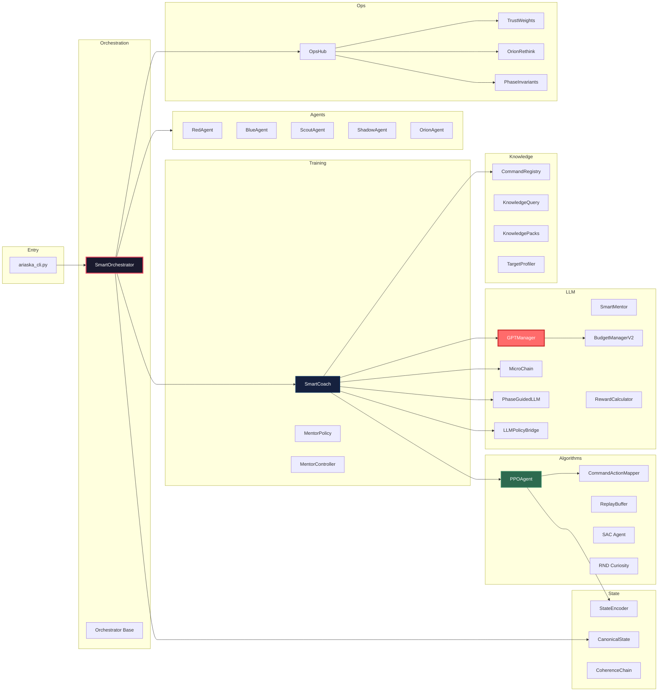

### Request Flow — Single Step

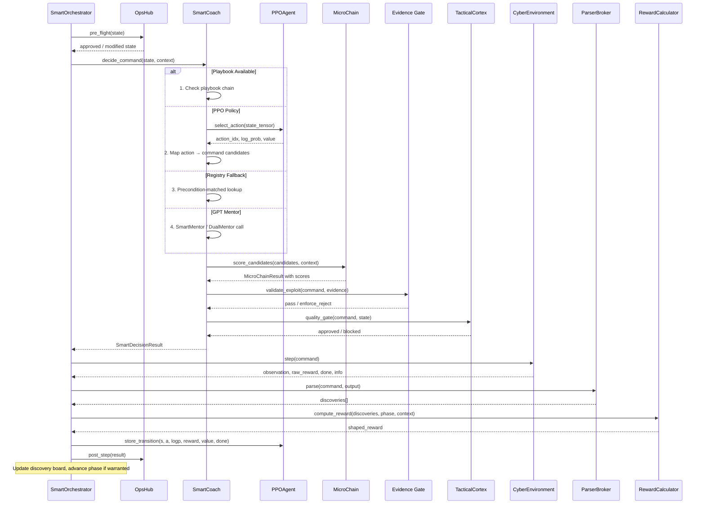

---

## The Five Agents

Ariaska deploys five specialized agents, each implementing the `AgentInterface` and `MemorySyncInterface` contracts. They share a common discovery board but maintain independent learning trajectories, memory stores, and tactical personalities.

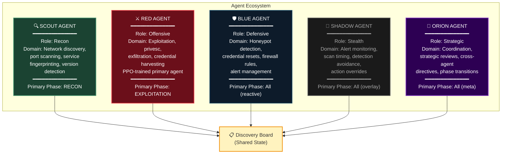

### Agent Activation Order (Phase-Dependent)

The activation sequence changes based on the current kill chain phase to ensure the most relevant agent acts first:

| Kill Chain Phase | Activation Order | Rationale |
|:---|:---|:---|
| **RECON** | Scout → Shadow → Orion → Red → Blue | Discovery-first; Shadow ensures stealth scanning |
| **ENUMERATION** | Scout → Shadow → Orion → Red → Blue | Deep enumeration before exploitation attempts |
| **EXPLOITATION** | Red → Shadow → Scout → Orion → Blue | Offensive-first; Scout fills intelligence gaps |
| **PRIVILEGE_ESCALATION** | Red → Shadow → Orion → Scout → Blue | Red drives privesc; Orion coordinates |
| **LATERAL_MOVEMENT** | Red → Shadow → Orion → Scout → Blue | Red pivots; Shadow masks movement |
| **POST_EXPLOITATION** | Red → Shadow → Orion → Scout → Blue | Red harvests; Orion strategizes exfil |
| **EXFILTRATION** | Red → Shadow → Orion → Scout → Blue | Red executes; Shadow provides cover |
| **CLOSEOUT** | Orion → Shadow → Blue → Scout → Red | Orion leads review; Blue validates |

### Agent Interface Contract

Every agent must implement:

```python
from core.interfaces.agent_interface import AgentInterface
from core.interfaces.memory_sync_interface import MemorySyncInterface

class Agent(AgentInterface, MemorySyncInterface):
    @property
    def agent_id(self) -> str: ...          # Unique identifier
    
    @property
    def role(self) -> str: ...              # "recon" | "offensive" | "defensive" | "stealth" | "strategic"
    
    def act(self, state: Dict[str, Any]) -> Dict[str, Any]: ...
    def learn(self, state, action, reward, next_state, done) -> float: ...
    def simulate_step(self, episode, step, shared_context) -> Dict[str, Any]: ...
    def sync_memory(self) -> bool: ...      # Cross-agent memory fusion
    def reset(self) -> None: ...
```

---

## Decision Pipeline — SmartCoach

The `SmartCoach` (9,306 lines — the largest file in the system) is the per-agent decision engine. Each of the five agents has its own SmartCoach instance. It selects commands through a **4-stage hybrid pipeline** with multiple intelligence overlays:

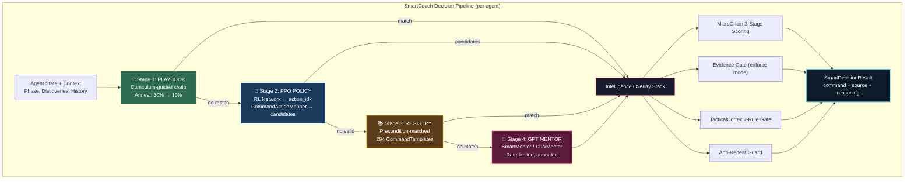

### Decision Source Tracking

Every command decision is tagged with its source for telemetry and analysis:

| Source | Origin | Description |
|:---|:---|:---|
| `"playbook"` | Stage 1 | Curriculum-guided playbook chain |
| `"ppo"` | Stage 2 | PPO policy network action |
| `"registry"` | Stage 3 | CommandRegistry precondition match |
| `"mentor"` | Stage 4 | SmartMentor GPT call |
| `"dual_mentor"` | Stage 4 | DualMentor (GPT + Venice) |
| `"micro_chain"` | Intelligence | MicroChain nano→mini→nano override |
| `"phase_guided"` | Intelligence | PhaseGuidedLLM structured guidance |
| `"anti_repeat"` | Guard | Anti-repeat replacement from role pool |
| `"fallback"` | Emergency | Emergency fallback command |

### Anti-Repeat Guard

The system maintains per-role replacement pools. When a command is detected as a repeat (exact match or prefix match against recent history), it is substituted with a contextually appropriate alternative from the agent's role-specific pool.

---

## PPO — Primary RL Algorithm

**File:** `core/algorithms/ppo_agent.py` (1,906 lines)

The Proximal Policy Optimization agent is the core learning engine. It uses an Actor-Critic architecture with extensive enhancements accumulated from R68 through R80+ refinement rounds.

### Network Architecture

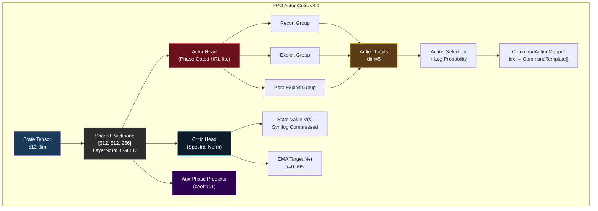

### PPO Configuration

```python
PPOConfig:
    state_dim        = 512                    # Matches StateEncoder output
    action_dim       = 5                      # Via CommandActionMapper
    hidden_dims      = [512, 512, 256]        # 3-layer backbone
    clip_epsilon     = 0.2                    # Adaptive: 0.15–0.25
    gamma            = 0.99                   # Discount factor
    gae_lambda       = 0.97                   # GAE-λ (dual: +0.70 short)
    learning_rate    = 3e-4 → 1e-5            # KL-adaptive annealing
    epochs_per_update = 4                     # PPO epochs per rollout
    minibatch_size   = 16                     # Mini-batch for updates
    max_grad_norm    = 0.5                    # Gradient clipping
    rollout_size     = 256                    # Steps per rollout buffer
```

### Advanced Features (R68–R80+)

| Feature | Description | Key Parameter |
|:---|:---|:---|
| **Phase-Gated Actor Heads** | HRL-lite: 3 action groups (recon / exploit / post-exploit) | Soft gating by phase |
| **Self-Imitation Learning (SIL)** | Replay high-reward trajectories | Buffer: 500, coef: 0.25 |
| **Symlog Value Compression** | DreamerV3-style value scaling | Prevents value explosion |
| **Cosine Entropy Schedule** | Entropy decay with periodic rebound | Maintains exploration |
| **Prioritized Advantage Sampling** | Focus on high-advantage transitions | Top-k selection |
| **Gradient Accumulation** | 2× effective batch size | Stability on small batches |
| **KL-Adaptive Learning Rate** | Auto-adjust LR to maintain target KL | target_kl: 0.01 |
| **Per-Phase Advantage Whitening** | Normalize advantages within each phase | Reduces phase bias |
| **EMA Target Network** | Exponential moving average for value | τ: 0.995 |
| **Value-Surprise Intrinsic Bonus** | Reward novel states | coef: 0.3 |
| **Dual-Horizon GAE** | Long λ=0.97 + short λ=0.70, blend 0.65 | Multi-timescale credit |
| **Spectral Normalization** | Stabilize critic gradients | On critic layers |
| **Soft Advantage Clipping** | tanh-based smooth clipping | Reduces outlier impact |
| **Auxiliary Phase Prediction** | Multi-task learning head | coef: 0.1 |
| **Adaptive Clip Scheduling** | Clip ε from rolling clip_fraction | 0.15–0.25 range |
| **Contrastive State Learning** | Separate similar states | Phase 42 |

### PPO Training Loop

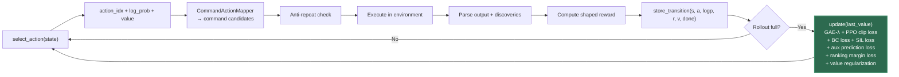

---

## State Representation

**File:** `core/models/state_encoder.py` (698 lines) — produces a **512-dimensional** tensor.

### State Vector Layout

| Dimensions | Content | Count |
|:---|:---|:---:|
| `0–11` | Phase one-hot encoding + progress ratio | 12 |
| `12–26` | Binary state flags (ports_discovered, shell_obtained, etc.) | 15 |
| `27–46` | Top 20 port presence indicators | 20 |
| `47–58` | Service type presence (http, ssh, ftp, smb, etc.) | 12 |
| `59–70` | Numeric features (detection_risk, blue_team_alert, stagnation, etc.) | 12 |
| `71–80` | Action history encoding (recent 10 actions) | 10 |
| `81–85` | LLM / Mentor features (call rate, confidence, budget remaining) | 5 |
| `86–90` | Temporal features (step ratio, phase duration, time pressure) | 5 |
| `91–511` | Reserved (zero-padded for future expansion) | 421 |
| — | **Total** | **512** |

### Enhanced State (Phase 37+)

When the LLM Policy Bridge is active, the state is augmented with a 256-dim LLM feature vector:

```
┌─────────────────────────────┬──────────────────────────┐
│     Base State (512-dim)    │   LLM Features (256-dim) │
│  Phase, flags, ports,       │  Semantic context,        │
│  services, numerics,        │  confidence signals,      │
│  history, temporal          │  reasoning embeddings     │
└─────────────────────────────┴──────────────────────────┘
              ↓                          ↓
        ┌─────────────────────────────────────┐
        │      Enhanced State (768-dim)        │
        │  Used by LLMPolicyBridge for         │
        │  prior distribution + KL teaching    │
        └─────────────────────────────────────┘
```

> **Invariant:** `STATE_DIM = 512` is hardcoded throughout the system. Changing it requires rebuilding **all** network architectures.

---

## Kill Chain & Environment

**File:** `core/environment/cyber_environment.py` (2,969 lines)

The `CyberEnvironment` is a stateful kill chain simulator that tracks engagement progress across eight phases:


### Phase Transition Rules

Phase advancement is controlled by `FF_STRICT_PHASE_LADDER` (ON by default). Each phase has explicit preconditions:

| Phase | Required State Flags | Auto-Advance Condition |
|:---|:---|:---|
| RECON → ENUM | `ports_discovered` | ≥3 open ports found |
| ENUM → EXPLOIT | `services_enumerated` | ≥1 service version identified |
| EXPLOIT → PRIVESC | `shell_obtained` or `credential_found` | Shell or valid credential |
| PRIVESC → LATERAL | `privilege_escalated` | Root/admin access on one host |
| LATERAL → POST | `lateral_movement_done` | Access on ≥2 hosts |
| POST → EXFIL | `data_identified` | Sensitive data located |
| EXFIL → CLOSEOUT | `data_exfiltrated` | Data successfully extracted |

### Discovery Board (Shared State)

```python
discovery_board = {
    "ports": set(),           # Open ports discovered
    "services": set(),        # Service identifications
    "credentials": set(),     # Username/password pairs
    "vulns": set(),           # Vulnerabilities identified
    "shells": set(),          # Active shell sessions
    "users": set(),           # Discovered usernames
    "web_paths": set(),       # Web application paths
    "phase": "RECON",         # Current kill chain phase
    "flags_set": set(),       # State flags triggered
}
```

### Environment API

```python
env = CyberEnvironment(target_ip="10.10.10.X")

state = env.reset()                          # Initialize engagement
state, reward, done, info = env.step(action) # Execute action, observe result
global_state = env.get_global_state()        # Full state snapshot
```

---

## Intelligence Layers

### MicroChain (Phase 27)

**File:** `core/llm/micro_chain.py` (782 lines)

A 3-stage iterative LLM scoring pipeline that evaluates command candidates before execution:

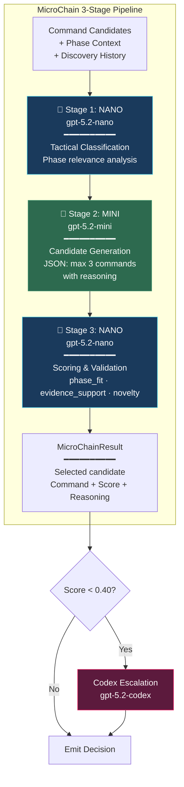

| Constant | Value | Override |
|:---|:---|:---|
| `ESCALATION_THRESHOLD` | 0.40 | `MC_ESCALATE_THRESHOLD` env var |
| `STAGNATION_ESCALATION_STEPS` | 9 | — |
| `STAGNATION_ESCALATION_SCORE` | 0.55 | — |
| `_MAX_CANDIDATES` | 3 | — |

**Ablation Mode:** Set `MC_NANO_ABLATION=1` to bypass nano stages 1 & 3 for A/B testing.

### PhaseGuidedLLM (Phase 34)

**File:** `core/llm/phase_guided_llm.py` (796 lines)

Produces structured JSON guidance for the current phase:

```json
{
  "phase_decision": {
    "current_phase": "EXPLOITATION",
    "stay_conditions": ["service vuln not yet confirmed"],
    "advance_conditions": ["shell obtained", "credential found"],
    "evidence": ["vsftpd 2.3.4 on port 21", "anonymous FTP allowed"]
  },
  "candidates": [
    {"template": "vsftpd_backdoor", "confidence": 0.89, "reasoning": "Known backdoor in 2.3.4"},
    {"template": "ftp_anon_write", "confidence": 0.72, "reasoning": "Anon write may allow webshell"},
    {"template": "hydra_ftp", "confidence": 0.45, "reasoning": "Brute force as fallback"}
  ],
  "anomaly_probes": ["Check if vsftpd patched", "Verify port 6200 listens after trigger"],
  "distillation_packet": { ... }
}
```

| Constant | Value | Notes |
|:---|:---|:---|
| `_CODEX_ESCALATION_CONFIDENCE` | 0.45 | Below this → codex model |
| `_STALL_THRESHOLD` | 8 | Steps before stagnation escalation |
| `_MIN_CANDIDATES` | 3 | Minimum candidate suggestions |
| `_MAX_CANDIDATES` | 6 | Maximum candidate suggestions |

### LLM Policy Bridge (Phase 37)

**File:** `core/llm/llm_policy_bridge.py` (784 lines)

The Level 5 neural integration layer that fuses LLM reasoning directly into the PPO policy:

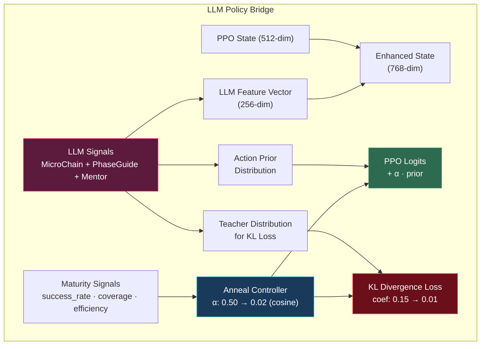

**Key Parameters:**

| Parameter | Initial | Final | Schedule |
|:---|:---:|:---:|:---|
| Prior alpha (α) | 0.50 | 0.02 | Cosine annealing over 3000 steps |
| KL teacher coef | 0.15 | 0.01 | Cosine annealing over 3000 steps |
| Ranking loss coef | 0.05 | 0.05 | Fixed |
| Value reg coef | 0.10 | 0.10 | Fixed |
| LLM feature dim | 256 | 256 | Fixed |

### Evidence Gate

Located within SmartCoach. Validates that exploit-phase commands have sufficient evidence before execution.

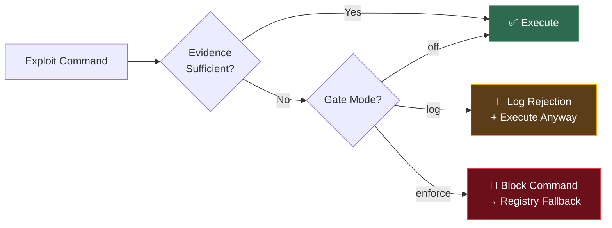

| Mode | Env Var | Behavior |
|:---|:---|:---|
| `off` | `FF_STRICT_EXPLOIT_GATE=off` | Gate disabled entirely |
| `log` | `FF_STRICT_EXPLOIT_GATE=log` | Log rejections, allow execution |
| **`enforce`** (default) | `FF_STRICT_EXPLOIT_GATE=enforce` | **Block command, fall back to registry** |

---

## Distillation Pipeline

The distillation system transfers LLM reasoning into the PPO policy network, enabling the RL agent to internalize GPT-level tactical intelligence over time:

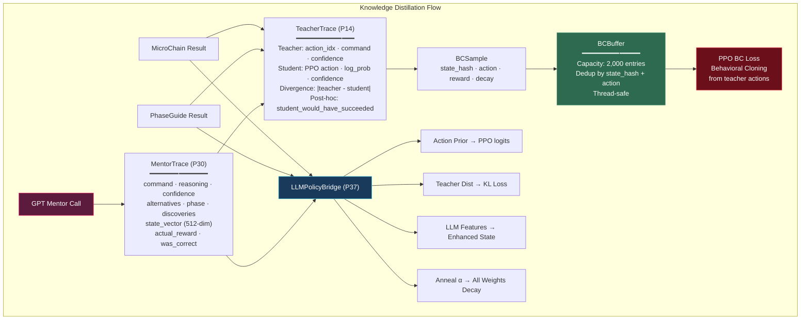

### MentorTrace Schema (Phase 30)

```python
@dataclass
class MentorTrace:
    # Decision
    command: str              # Selected command
    reasoning: str            # ≤512 chars explanation
    confidence: float         # 0.0–1.0
    alternatives: List[str]   # Max 3 alternatives considered
    
    # Context
    phase: str                # Kill chain phase at call time
    step: int                 # Step number
    episode: int              # Episode number
    discoveries_at_call: int  # Discovery count when called
    stagnation_steps: int     # Steps without progress
    
    # State
    state_vector: List[float] # 512-dim for BC training
    
    # Quality (post-hoc)
    actual_reward: float      # Reward received after execution
    produced_discovery: bool  # Whether new discovery resulted
    mentor_was_correct: bool  # Whether outcome validated choice
```

---

## Knowledge System (v2)

**107,933 entries** across 18 JSONL partitions with 12 prebuilt indices.

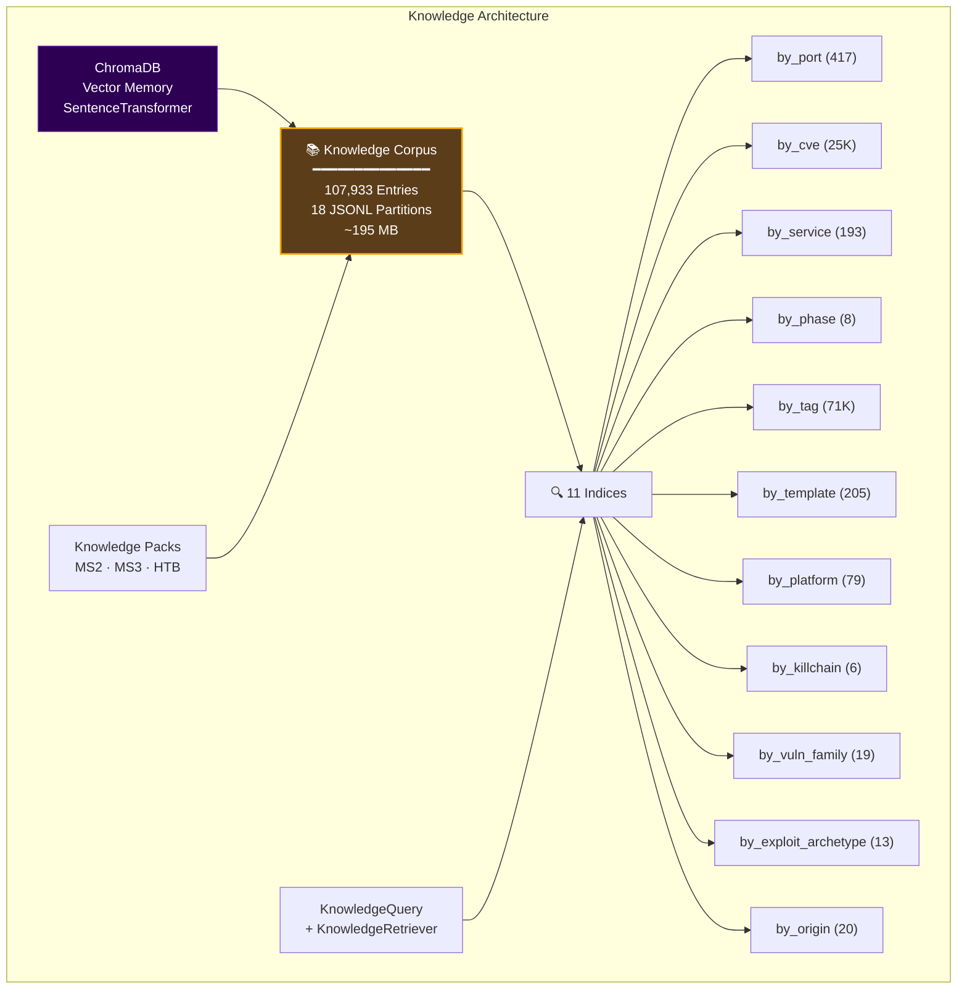

### KnowledgeCandidate Schema (v2)

Each entry in the corpus follows a deeply nested schema with 14 dataclasses:

```python
@dataclass
class KnowledgeCandidate:
    candidate_id: str              # Unique identifier
    title: str                     # Human-readable title
    taxonomy: Taxonomy             # service_archetype, phase_fit, killchain_step, tags
    evidence_gate: EvidenceGate    # evidence_requirements, confidence_tier
    execution: Execution           # tool, original_command, command_templates, parameters
    references: References         # cves, urls, mitre ATT&CK mappings
    quality: QualityMetrics        # accuracy, reliability scores
    governance: Governance         # origin, ingestion_date, review status
    source: SourceInfo             # provenance tracking
```

### Index Quick-Reference

| Index | Entries | Use Case |
|:---|---:|:---|
| `by_port` | 417 | Port-specific exploit lookup |
| `by_cve` | 25,000 | CVE-based vulnerability matching |
| `by_service` | 193 | Service-type technique retrieval |
| `by_phase` | 8 | Phase-appropriate command selection |
| `by_tag` | 71,000 | Tag-based multi-criteria search |
| `by_template` | 205 | Template name resolution |
| `by_platform` | 79 | OS/platform-specific filtering |
| `by_killchain` | 6 | Kill chain step alignment |
| `by_vuln_family` | 19 | Vulnerability family grouping |
| `by_exploit_archetype` | 13 | Exploit pattern matching |
| `by_origin` | 20 | Source/provenance filtering |

---

## Token Budget Management

**File:** `core/llm/budget_manager.py` (607 lines)

The `BudgetManagerV2` controls all LLM token spending with per-tier budgets, dynamic scaling, and burst reserves.

### Budget Allocation

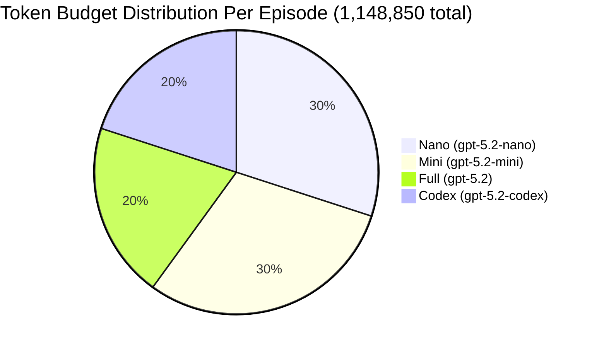

| Tier | Models | Budget | Share |
|:---|:---|---:|:---:|
| **Codex** | gpt-5.2-codex | 199,800 | 20% |
| **Full** | gpt-5.2 | 199,800 | 20% |
| **Mini** | gpt-5.2-mini, gpt-5-mini | 299,700 | 30% |
| **Nano** | gpt-5.2-nano, gpt-5-nano | 299,700 | 30% |

### Budget Constants

| Constant | Value | Notes |
|:---|---:|:---|
| `_TOTAL_BUDGET` | 1,148,850 | ~$3.83/episode ceiling |
| `_MIN_BUDGET` | 574,425 | 50% floor (never go below) |
| `_BURST_POOL_RATIO` | 12% | Of max budget as burst reserve |
| `_BURST_STEP_CAP_RATIO` | 3% | Per-step burst spending limit |
| `_BURST_COOLDOWN_STEPS` | 5 | Min steps between burst draws |
| `_BURST_TIERS` | mini, codex | Only these tiers get burst access |

### Dynamic Scaling

Budget scales inversely with agent maturity:

```
budget_scale = max(MIN_SCALE, 1.0 - maturity_signal)

maturity_signal = 0.4 × success_rate
                + 0.3 × skill_coverage
                + 0.2 × discovery_efficiency
                + 0.1 × (1 - stagnation_rate)
```

As the agent becomes more capable, LLM budget automatically decreases — the RL policy increasingly handles decisions independently.

### LLM Routing Rules

| Task Type | Model | Tier |
|:---|:---|:---|
| Tactical reasoning | gpt-5.2-codex | codex |
| Strategic planning | gpt-5.2-codex | codex |
| Postmortem analysis | gpt-5.2-codex | codex |
| Parsing / verification | gpt-5.2 | full |
| Playbook selection | gpt-5.2-mini | mini |
| Structured extraction | gpt-5.2-mini | mini |
| MicroChain stages 1 + 3 | gpt-5.2-nano | nano |
| Classification | gpt-5.2-nano | nano |

---

## Reward Architecture

**File:** `core/llm/reward_calculator.py` (906 lines)

Reward range: **[-15.0, +100.0]** (Phase 38 raised ceiling from 50 → 100 for proper gradient signal).

### Discovery Bonuses

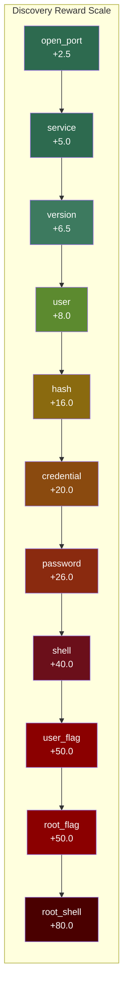

| Discovery Type | Reward | Description |
|:---|---:|:---|
| `open_port` | +2.5 | New open port discovered |
| `service` | +5.0 | Service identification |
| `version` | +6.5 | Version fingerprint |
| `user` / `username` | +8.0 | Username enumeration |
| `hash` | +16.0 | Password hash captured |
| `credential` | +20.0 | Valid credential pair |
| `password` | +26.0 | Cleartext password |
| `shell` | +40.0 | Shell session obtained |
| `user_flag` | +50.0 | User flag captured (CTF) |
| `root_flag` | +50.0 | Root flag captured (CTF) |
| `root_shell` | +80.0 | Root/admin shell obtained |

### Phase Milestone Rewards

| Phase Reached | Reward |
|:---|---:|
| RECON | 0.0 |
| ENUMERATION | +5.0 |
| EXPLOITATION | +15.0 |
| PRIVILEGE_ESCALATION | +30.0 |
| LATERAL_MOVEMENT | +45.0 |
| POST_EXPLOITATION | +60.0 |
| EXFILTRATION | +75.0 |
| CLOSEOUT | +90.0 |

### Reward-Invariant Metrics

These metrics measure **real learning quality** independent of reward scaling, and should always be used to validate changes:

| Metric | Description |
|:---|:---|
| `unique_commands` | Distinct commands used per episode |
| `diversity_ratio` | unique_commands / total_steps |
| `total_discoveries` | Genuinely new discoveries per episode |
| `step_at_first_exploit` | Speed to first exploitation |
| `completion_bonus_applied` | Whether EXFILTRATION was reached |

---

## OpsHub — Operational Authority (Phase 38)

**File:** `core/ops/ops_hub.py` (524 lines) — orchestrates 25 operational modules (7,000+ lines total)

The OpsHub is the operational authority layer that runs **pre-flight checks** before each step and **post-step processing** after each step.

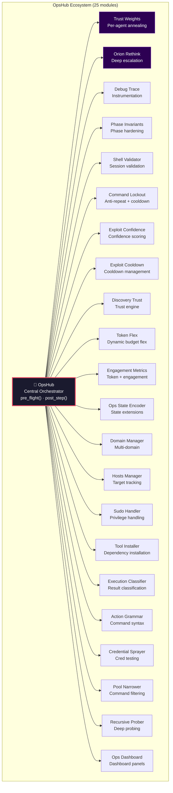

### Pre-Flight / Post-Step Flow

```
┌──────────────────────────────────────────┐
│           OpsHub.pre_flight(state)        │
│  ├── Phase invariant validation           │
│  ├── Shell session health check           │
│  ├── Command lockout review               │
│  ├── Exploit cooldown check               │
│  ├── Trust weight computation             │
│  ├── Token budget flex adjustment         │
│  └── State encoder augmentation           │
├──────────────────────────────────────────┤
│           → SmartCoach decides            │
│           → Command executes              │
├──────────────────────────────────────────┤
│           OpsHub.post_step(result)        │
│  ├── Discovery trust scoring              │
│  ├── Engagement metrics update            │
│  ├── Exploit confidence recalc            │
│  ├── Orion rethink check (if stalled)     │
│  ├── Trust weight update                  │
│  ├── Debug trace emission                 │
│  └── Dashboard panel refresh              │
└──────────────────────────────────────────┘
```

---

## Observability & Dashboard

**File:** `core/observability/live_dashboard.py` (2,965 lines)

The LiveDashboard v6.0 provides a real-time Rich terminal UI showing all aspects of the engagement:

```
┌─────────────────────────── ARIASKA RL — Live Dashboard v6.0 ───────────────────────────┐
│                                                                                         │
│  ┌─ Phase Progress ──────────────────┐  ┌─ Agent Activity ────────────────────────────┐ │
│  │ RECON ████████████░░░░ 78%        │  │ Scout  [ACTIVE]  nmap -sV 10.10.10.5       │ │
│  │ Phase: ENUMERATION (step 47/500)  │  │ Red    [IDLE]    waiting for service data   │ │
│  │ Discoveries: 12  Unique Cmds: 31  │  │ Shadow [ACTIVE]  monitoring IDS alerts      │ │
│  │ Diversity: 0.66  Stagnation: 0    │  │ Orion  [IDLE]    strategic review pending   │ │
│  └────────────────────────────────────┘  │ Blue   [IDLE]    no threats detected        │ │
│                                          └────────────────────────────────────────────┘ │
│  ┌─ Token Budget ────────────────────┐  ┌─ Decision Source ─────────────────────────┐  │
│  │ Total: 847,231 / 1,148,850        │  │ playbook:  ████████░░░  42%              │  │
│  │ Codex: 152,400 / 199,800          │  │ ppo:       ██████░░░░░  31%              │  │
│  │ Mini:  234,100 / 299,700          │  │ registry:  ███░░░░░░░░  15%              │  │
│  │ Nano:  189,300 / 299,700          │  │ mentor:    ██░░░░░░░░░   8%              │  │
│  │ Burst: 42,000 remaining           │  │ fallback:  █░░░░░░░░░░   4%              │  │
│  └────────────────────────────────────┘  └──────────────────────────────────────────┘  │
│                                                                                         │
│  ┌─ Recent Discoveries ──────────────────────────────────────────────────────────────┐  │
│  │ [step 45] open_port: 21/tcp (ftp)           +2.5  Scout                          │  │
│  │ [step 46] service: vsftpd 2.3.4             +5.0  Scout                          │  │
│  │ [step 47] version: vsftpd 2.3.4 (backdoor)  +6.5  Scout                         │  │
│  └────────────────────────────────────────────────────────────────────────────────────┘  │
│                                                                                         │
│  ┌─ LLM Policy Bridge ──────────────┐  ┌─ Trust Weights ──────────────────────────┐   │
│  │ Prior α: 0.38 (annealing)        │  │ Scout:  0.92  Red: 0.85  Blue: 0.78     │   │
│  │ KL coef: 0.12 → 0.01             │  │ Shadow: 0.88  Orion: 0.95               │   │
│  │ Teacher divergence: 0.23         │  │ Update: trust_weights.anneal()           │   │
│  └────────────────────────────────────┘  └─────────────────────────────────────────┘   │
└─────────────────────────────────────────────────────────────────────────────────────────┘
```

### Trace & Telemetry

| Component | Format | Purpose |
|:---|:---|:---|
| `EpisodeTrace` | JSONL | Per-step structured trace with decisions, rewards, discoveries |
| `EventBus` | Pub/Sub | Real-time step/agent events for decoupled consumers |
| `JSONLLogger` | JSONL | Structured logging for offline analysis |
| `LiveTrace` | Append-only JSONL | Real-time state trace for debugging |
| `DebugTrace` | Instrumented | Phase 39 deep instrumentation |

---

## Feature Flag System

**File:** `core/feature_flags.py` (463 lines) — **90+ flags** with env-var overrides (prefix `FF_`)

### Runtime Profiles

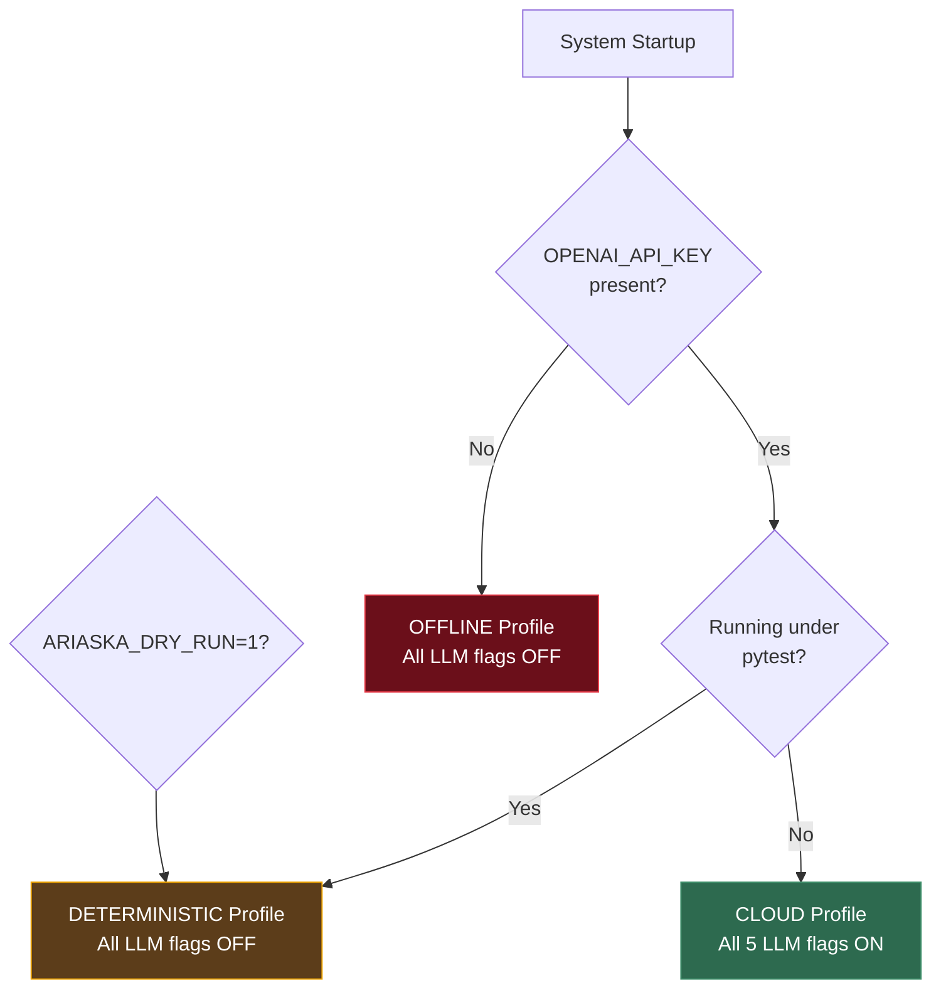

| Profile | Condition | LLM Flags | Parser Mode |
|:---|:---|:---|:---|
| **CLOUD** | `OPENAI_API_KEY` present | ON | `intelligent_fullparse` |
| **DETERMINISTIC** | pytest / `ARIASKA_DRY_RUN=1` | OFF | `intelligent_fullparse` |
| **OFFLINE** | No API key | OFF | `intelligent_fullparse` |

### Critical Feature Flags

| Flag | Phase | Default | Purpose |
|:---|:---:|:---:|:---|
| `FF_USE_MICRO_CHAIN` | 27 | ON | MicroChain 3-stage LLM scoring |
| `FF_STRICT_EXPLOIT_GATE` | 27 | `enforce` | Evidence gate for exploit validation |
| `FF_BUDGET_MANAGER_V2` | 15 | ON | Dynamic tiered token budgets |
| `FF_STRICT_PHASE_LADDER` | 11 | ON | Phase ordering enforcement |
| `FF_BC_LOSS` | 14 | ON | Behavioral cloning loss from teacher |
| `FF_TEACHER_TRACE` | 14 | ON | Distillation pipeline active |
| `FF_PARALLEL_AGENTS` | 27 | ON | Multi-agent parallel activation |
| `FF_NEUROMODULATORS` | 15 | ON | Biologically-inspired control |
| `FF_EVIDENCE_GRAPH` | 14 | ON | Evidence graph reasoning |
| `FF_HYPOTHESIS_ENGINE` | 14 | ON | Hypothesis formulation |
| `FF_LLM_POLICY_BRIDGE` | 37 | ON | Level 5 GPT↔RL neural integration |
| `FF_OPS_HUB` | 38 | ON | OpsHub pre-flight/post-step |
| `FF_DISCOVERY_TRUST` | 38 | ON | Discovery trust scoring |
| `FF_PHASE_INVARIANTS` | 38 | ON | Phase hardening + shell validation |
| `FF_COMMAND_LOCKOUT` | 38 | ON | Anti-repeat + cooldown |
| `FF_TOKEN_FLEX` | 38 | ON | Dynamic token budget flex |
| `FF_ORION_RETHINK` | 39 | ON | Orion deep-rethink escalation |
| `FF_TRUST_WEIGHTS` | 39 | ON | Per-agent trust weight annealing |
| `FF_CAP_GATE` | 39 | ON | CAP regression gate |
| `FF_DEBUG_TRACE` | 39 | ON | Debug trace instrumentation |
| `FF_SSH_POOL` | 40 | ON | Persistent SSH session pool |
| `FF_PARALLEL_EXEC` | 40 | ON | Parallel agent execution |
| `FF_OS_AWARE_FILTER` | 40 | ON | OS-aware command filtering |
| `FF_POOL_NARROWER` | 40 | ON | Adaptive command pool narrowing |
| `FF_AUTO_WEB_PROBE` | 40 | ON | Web path auto-discovery |
| `FF_DASHBOARD_V6` | 40 | ON | Dashboard v6.0 UI |
| `FF_HER_WIRING` | 42 | ON | Hindsight Experience Replay |
| `FF_CONTRASTIVE_PPO` | 42 | ON | Contrastive state learning |
| `FF_ACTION_GRAMMAR` | 42 | ON | Command syntax validation |
| `FF_HALLUCINATION_GUARD` | 42 | ON | LLM hallucination detection |
| `FF_LOCAL_LLM` | 43 | OFF | Local LLM inference (auto-detected) |
| `FF_COGNITION_NODE` | C07 | ON | Cognitive architecture |
| `FF_SAC_SHADOW` | C07 | ON | SAC shadow agent |
| `FF_REPTILE_META` | C07 | ON | Reptile meta-learning |

---

## Command Registry

**File:** `core/commands/command_registry.py` (4,595 lines) — **294 command templates**

```python
register(CommandTemplate(
    name="nmap_version_scan",
    template="nmap -sV -p {ports} {target}",
    description="Service version detection on specific ports",
    phase=AttackPhase.ENUMERATION,
    required_params=["target"],
    optional_params={"ports": "1-1000"},
    preconditions={"ports_discovered"},
    success_indicators=["open", "VERSION"],
    typical_reward=3.0,
    tags={"recon", "version", "nmap"},
))
```

### Commands by Phase

| Attack Phase | Command Count | Example Tools |
|:---|:---:|:---|
| RECON | ~45 | nmap, masscan, ping, traceroute |
| ENUMERATION | ~80 | nmap -sV, nikto, dirb, enum4linux, snmpwalk |
| EXPLOITATION | ~75 | metasploit, searchsploit, hydra, sqlmap |
| PRIVILEGE_ESCALATION | ~40 | linpeas, sudo -l, find SUID, kernel exploits |
| LATERAL_MOVEMENT | ~20 | ssh, psexec, pivoting, port forwarding |
| POST_EXPLOITATION | ~15 | hashdump, mimikatz, data search |
| EXFILTRATION | ~10 | scp, nc, base64 encode, HTTP exfil |
| CLOSEOUT | ~9 | cleanup, reporting, evidence collection |

---

## Memory Architecture

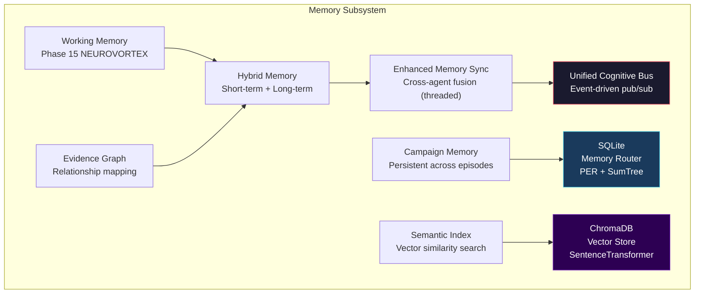

| Component | File | Purpose |
|:---|:---|:---|
| `HybridMemory` | `core/memory/hybrid_memory.py` | Short-term + long-term dual store |
| `EnhancedMemorySync` | `core/memory/enhanced_memory_sync.py` | Cross-agent threaded memory fusion |
| `UnifiedCognitiveBus` | `core/memory/unified_cognitive_bus.py` | Pub/sub event bus for memory events |
| `CampaignMemory` | `core/memory/campaign_memory.py` | Persistent state across episodes |
| `WorkingMemory` | `core/memory/working_memory.py` | Active context buffer (NEUROVORTEX) |
| `SemanticIndex` | `core/memory/semantic_index.py` | Vector similarity for retrieval |
| `EvidenceGraph` | `core/memory/evidence_graph.py` | Relationship mapping between findings |
| `ChromaMemoryStore` | `core/memory/chroma_memory_store.py` | ChromaDB vector persistence |
| `MemoryRouter` | `core/multiagent/memory_router.py` | PER + SumTree, SQLite backed |
| `EpisodicMemory` | `core/algorithms/episodic_memory.py` | Episode-level recall (Phase 42) |

---

## Safety & Scope Controls

```mermaid
graph TB
    subgraph "Safety Layers"
        L1["Layer 1: IP Validation<br/>RFC 1918 allowlist only<br/>(RealToolRunner)"]
        L2["Layer 2: Command Blocklist<br/>Dangerous commands filtered<br/>(RealToolRunner)"]
        L3["Layer 3: Sandboxed Executor<br/>Isolated execution environment"]
        L4["Layer 4: Dry Run Mode<br/>ARIASKA_DRY_RUN=1<br/>No real commands execute"]
        L5["Layer 5: Evidence Gate<br/>Exploit validation required<br/>(enforce mode)"]
        L6["Layer 6: API Key Protection<br/>.env + python-dotenv<br/>Never hardcoded"]
        L7["Layer 7: Test Isolation<br/>FakeGPTManager + StubToolRunner<br/>Zero real execution"]
    end

    L1 --> L2 --> L3 --> L4 --> L5 --> L6 --> L7

    style L1 fill:#6b0f1a,stroke:#e63946,color:#fff
    style L2 fill:#7f2b0a,stroke:#f48c06,color:#fff
    style L3 fill:#5c3d1a,stroke:#f0a500,color:#fff
    style L5 fill:#1a3a5c,stroke:#48cae4,color:#fff
```

| Safety Mechanism | Description |
|:---|:---|
| **RFC 1918 Validation** | `RealToolRunner` only allows private IP ranges (10.x, 172.16-31.x, 192.168.x) |
| **Command Blocklist** | Dangerous commands (rm -rf, format, etc.) blocked at execution layer |
| **Sandboxed Executor** | Additional isolation layer around command execution |
| **Dry Run Mode** | `ARIASKA_DRY_RUN=1` prevents all real command execution |
| **Evidence Gate** | Exploit commands must have evidence before execution (enforce mode) |
| **API Key Security** | `.env` + `python-dotenv`, never hardcoded |
| **Test Isolation** | `FakeGPTManager` (deterministic) + `StubToolRunner` (no execution) |
| **Input Sanitization** | All LLM outputs sanitized before command construction |
| **Ethics Profiles** | Training / assessment / demo modes with appropriate constraints |

---

## Project Statistics

| Metric | Value |
|:---|---:|
| **Total Python Files** | 400+ |
| **Total Lines of Python** | ~160,000 |
| **Core Modules** | 340+ |
| **Test Files** | 145 |
| **Tests Collected** | 1,753 |
| **Tests Passing** | 1,753 (100%) |
| **Command Templates** | 294 |
| **Knowledge Entries** | 107,933 |
| **Knowledge Indices** | 12 |
| **Feature Flags** | 90+ |
| **Development Phases** | 43 |
| **Agents** | 5 |
| **Kill Chain Phases** | 8 |
| **State Dimensions** | 512 (768 enhanced) |
| **PPO Action Dimensions** | 5 |
| **LLM Tiers** | 4 (nano, mini, full, codex) |
| **Max Token Budget** | 1,148,850/episode |
| **Reward Range** | [-15.0, +100.0] |
| **BCBuffer Capacity** | 2,000 |
| **SIL Buffer** | 500 |
| **Ops Modules** | 25 |

### Largest Files

| File | Lines | Role |
|:---|---:|:---|
| `core/training/smart_coach.py` | 9,306 | Per-agent decision pipeline |
| `core/orchestration/smart_orchestrator.py` | 8,890 | Main training loop (THE BRAIN) |
| `core/commands/command_registry.py` | 4,595 | 294 command templates |
| `core/observability/live_dashboard.py` | 2,965 | Rich terminal dashboard |
| `core/environment/cyber_environment.py` | 2,969 | Kill chain state machine |
| `core/algorithms/ppo_agent.py` | 1,906 | PPO Actor-Critic v3.0 |
| `core/gpt_manager.py` | 1,619 | Centralized LLM gateway |
| `core/llm/reward_calculator.py` | 906 | Shaped reward computation |
| `core/llm/phase_guided_llm.py` | 796 | Phase-guided LLM reasoning |
| `core/llm/llm_policy_bridge.py` | 784 | Level 5 GPT↔RL bridge |
| `core/llm/micro_chain.py` | 782 | 3-stage MicroChain scoring |

---

## Getting Started

### Prerequisites

- **Python 3.11+** (developed on 3.13)
- **PyTorch 2.x** (CPU or CUDA)
- **Docker** (for Metasploitable targets)
- **OpenAI API Key** (for live LLM; system works offline without it)

### Installation

```bash
# Clone repository
git clone https://github.com/Reckless98/Ariaska_RL.git
cd Ariaska_RL

# Create virtual environment
python3.13 -m venv .venv
source .venv/bin/activate

# Install dependencies
pip install -r requirements.txt

# Configure environment
cp .env.example .env
# Edit .env to add OPENAI_API_KEY (optional — system works offline)

# Verify installation
make test
```

### Quick Start — Training

```bash
# Basic training against a target
python ariaska_cli.py smart-train --target 10.10.10.5 --steps 500

# CTF mode with seed for reproducibility
python ariaska_cli.py smart-train --target 10.10.10.5 --steps 1000 --ctf --seed 42

# Dry run (no real commands)
ARIASKA_DRY_RUN=1 python ariaska_cli.py smart-train --target 10.10.10.5 --steps 200

# Watchdog mode (auto-restart on failure)
python ariaska_cli.py watchdog --target 10.10.10.5 --max-attempts 10
```

### Quick Start — Metasploitable Lab

```bash
# Start Metasploitable 2 target
docker-compose -f docker-compose.metasploitable.yml up -d

# Run training against lab target
python ariaska_cli.py smart-train --target 172.17.0.2 --steps 500
```

---

## CLI Reference

```
Usage: python ariaska_cli.py <command> [options]

Commands:
  smart-train    Main training loop — continuous engagement
  watchdog       Auto-restarting training with failure recovery
  replay         Replay a saved episode trace
  status         Show current system status
  help           Display help information

Options for smart-train:
  --target IP      Target IP address (required)
  --steps N        Maximum steps per episode (default: 500)
  --ctf            Enable CTF flag detection mode
  --seed N         Random seed for reproducibility

Options for watchdog:
  --target IP      Target IP address (required)
  --max-attempts N Maximum restart attempts (default: 10)

Options for replay:
  <trace_file>     Path to JSONL trace file
  --verbose        Enable verbose replay output
```

---

## Testing

### Running Tests

```bash
# Full test suite (1,753 tests)
make test

# Quick run (skip integration)
make test-fast

# CAP regression harness
make test-cap

# With timeout safety
ARIASKA_DRY_RUN=1 pytest tests/ -x --tb=short -q --timeout=120

# Specific test file
pytest tests/test_ppo_agent.py -v
```

### Test Infrastructure

| Component | Purpose |
|:---|:---|
| `FakeGPTManager(seed=N)` | Deterministic LLM responses, token tracking, request history |
| `StubToolRunner` | Tracks commands without executing anything |
| `RealToolRunner` | RFC 1918 allowlist + blocked command filtering (integration tests) |
| `ToolResult` | Dataclass: stdout, stderr, return_code, timed_out |

### Test Pattern

```python
import pytest, os
from core.testing import FakeGPTManager, StubToolRunner, get_tool_runner

class TestMyFeature:
    @pytest.fixture(autouse=True)
    def setup(self):
        os.environ['ARIASKA_DRY_RUN'] = '1'
        self.gpt = FakeGPTManager(seed=42)
        self.tool_runner = get_tool_runner(testing=True)

    def test_something(self):
        from core.agents.red_agent import RedAgent  # Always lazy import!
        agent = RedAgent(gpt_manager=self.gpt, verbosity="quiet")
        result = agent.act({"phase": "RECON"})
        assert result is not None
```

---

## Configuration Reference

### Environment Variables

| Variable | Purpose | Default |
|:---|:---|:---|
| `OPENAI_API_KEY` | OpenAI API authentication | — (offline mode) |
| `ARIASKA_DRY_RUN` | `1` → prevent real command execution | `0` |
| `ARIASKA_TARGET` | Default target IP | — |
| `ARIASKA_ENV` | Environment type (htb, live, msf) | — |
| `MC_ESCALATE_THRESHOLD` | MicroChain escalation threshold | `0.40` |
| `MC_NANO_ABLATION` | `1` → bypass nano stages | `0` |
| `PYTHONPATH` | Should include project root | — |
| `FF_*` | Any feature flag override | (see flags table) |

### Runtime Flags

```python
from core.runtime_flags import get_runtime_flags
flags = get_runtime_flags()
# flags.offline    — True if no API key
# flags.enable_llm — True if LLM calls permitted
# flags.dry_run    — True if dry run mode
```

### Architectural Invariants

> ⚠️ **These are non-negotiable. Violation of any invariant breaks the system.**

1. **ALL LLM calls go through `GPTManager`** — never `import openai` directly
2. **Lazy imports inside methods** — deep circular dependency chains
3. **Single `GPTManager` instance** — inject via constructor, never instantiate new
4. **`rich` for output** — `Console()`, `Panel()`, `Table()` — never bare `print()`
5. **`logging.getLogger("ariaska.<module>")`** — for all debug/info
6. **`FakeGPTManager`** in tests — deterministic, no API calls
7. **`StubToolRunner`** in tests — tracks commands without execution
8. **`ARIASKA_DRY_RUN=1`** — env var for safe test execution
9. **STATE_DIM = 512** — hardcoded everywhere, change requires full rebuild
10. **Never modify PPO core** without explicit instruction
11. **BudgetManagerV2 clamps** — 1,148,850 max, 574,425 min (50% floor)
12. **Evidence Gate default = `enforce`**
13. **MicroChain escalation threshold = 0.40**
14. **Git policy: `master` branch only**
15. **Test baseline: 1,753 tests** — all must pass after any change

---

## Key Hyperparameters

| Parameter | Value | Location |
|:---|:---|:---|
| State dim | 512 | `state_encoder.py` |
| Action dim | 5 | `PPOConfig` |
| PPO clip ε | 0.2 (adaptive 0.15–0.25) | `PPOConfig` |
| PPO learning rate | 3e-4 → 1e-5 | `PPOConfig` |
| GAE λ | 0.97 (dual: +0.70 short) | `PPOConfig` |
| Discount γ | 0.99 | `PPOConfig` |
| SIL coefficient | 0.25 (buffer: 500) | `PPOConfig` |
| Minibatch size | 16 | `PPOConfig` |
| Mentor anneal | 60% → 10% | `MentorPolicy` |
| Total token budget | 1,148,850 | `BudgetManagerV2` |
| Min token budget | 574,425 | `BudgetManagerV2` |
| MicroChain threshold | 0.40 | `micro_chain.py` |
| PhaseGuide codex threshold | 0.45 | `phase_guided_llm.py` |
| Reward range | [-15.0, +100.0] | `reward_calculator.py` |
| BCBuffer capacity | 2,000 | `teacher_trace.py` |
| LLM feature dim | 256 | `llm_policy_bridge.py` |
| Enhanced state dim | 768 (512 + 256) | `state_encoder.py` |
| Prior α init → final | 0.50 → 0.02 (cosine) | `llm_policy_bridge.py` |
| KL teacher coef | 0.15 → 0.01 | `llm_policy_bridge.py` |
| Ranking loss coef | 0.05 | `PPOConfig` |
| Value reg coef | 0.10 | `PPOConfig` |
| Anneal steps | 3,000 | `LLMPolicyBridge` |
| EMA target τ | 0.995 | `PPOConfig` |
| Value-surprise coef | 0.3 | `PPOConfig` |
| Dual GAE blend | 0.65 | `PPOConfig` |

---

## Phase History

| Phase | Focus | Key Additions |
|:---|:---|:---|
| **9.5–9.7** | Foundation | Feature flags, correctness fixes, telemetry, KG + LLM wiring |
| **10** | Pre-HTB Hardening | Privilege gating, sudo, wordlists, payload encoding |
| **11** | Step Discipline | Parser modes, phase ladder, adaptive budget |
| **14** | Autonomous Reasoning | Evidence graph, hypothesis engine, BC loss, teacher trace |
| **15** | NEUROVORTEX | Neuromodulators, reflex policy, working memory, consolidation |
| **16** | Progress Estimation | Progress estimator for engagement tracking |
| **19** | HTB Intelligence | Auto-profiling, regex hardening, PCAP extraction |
| **27** | Intelligence Pipeline | MicroChain, Evidence Gate, parallel agents |
| **28** | Postmortem | Skill library persistence |
| **29** | Event Bus | Decoupled pub/sub architecture |
| **30** | MentorTrace | Structured mentor→apprentice transfer |
| **31** | Episode Replay | JSONL trace replay via CLI |
| **32** | MicroChain Tuning | Env-var configurable thresholds |
| **33** | Budget Burst | Burst pool, candidate cap, dynamic cooldown |
| **34** | PhaseGuidedLLM | Structured guidance + distillation packets |
| **35** | Canonical State | Single source of truth, CoherenceChain, LiveTrace |
| **36** | Codex Routing | Codex-primary models, +23% token headroom |
| **37** | Level 5 Integration | LLMPolicyBridge, KL teaching, ranking loss, value reg |
| **38** | OpsHub Authority | 19 ops modules, discovery trust, phase hardening, reward ceiling 50→100 |
| **39** | Trust + Rethink | Trust weights, Orion deep-rethink, CAP regression gate, debug trace |
| **40** | UX + Execution | Dashboard v6, SSH pool, parallel exec, OS-aware filtering, web probing |
| **42** | Deep Wiring | HER, DAgger, contrastive PPO, action grammar, hallucination guard |
| **43** | GPU + Local LLM | GPU acceleration, local LLM offloading for nano/mini tiers |

---

## File Map — Complete Module Reference

<details>
<summary><strong>Click to expand full file map (~340 modules)</strong></summary>

```
ariaska_cli.py                              # CLI entry: smart-train, replay, watchdog, status, help
core/
├── agents/                                 # 5 agents (all implement AgentInterface + MemorySyncInterface)
│   ├── red_agent.py                        # RedAgent — offensive exploitation
│   ├── blue_agent.py                       # BlueAgent — defensive/reactive
│   ├── scout_agent.py                      # ScoutAgent — recon/discovery
│   ├── shadow_agent.py                     # ShadowAgent — stealth/alert prevention
│   ├── orion_agent.py                      # OrionAgent — strategic coordination
│   ├── enhanced_agent_base.py              # EnhancedAgentBase mixin
│   └── redagent_brain.py                   # RedAgent brain (extended cognition)
├── algorithms/
│   ├── ppo_agent.py             (1906L)    # PPOAgent — primary RL, Actor-Critic v3.0
│   ├── command_action_mapper.py            # PPO action_idx ↔ CommandTemplate mapping
│   ├── replay_buffer.py                    # PER with dedup
│   ├── sac_agent.py                        # Soft Actor-Critic (shadow policy)
│   ├── ddqn_macro.py                       # Double DQN macro-actions
│   ├── rnd_curiosity.py                    # RND intrinsic motivation
│   ├── cognition_node.py                   # Cognitive architecture node
│   ├── attention_ppo.py                    # Attention-based PPO variant
│   ├── auto_curriculum.py                  # Automatic curriculum generation
│   ├── contrastive_state.py                # Contrastive state learning (P42)
│   ├── episodic_memory.py                  # Episodic memory for RL (P42)
│   ├── hindsight_replay.py                 # HER wiring (P42)
│   ├── reptile_meta.py                     # Reptile meta-learning
│   ├── ensemble_voting.py                  # Ensemble action voting
│   ├── world_model.py                      # World model for planning
│   └── ...                                 # 26 algorithm modules total
├── commands/
│   ├── command_registry.py      (4595L)    # 294 CommandTemplates by AttackPhase
│   ├── command_enrichment.py               # Enrich commands with knowledge
│   └── learned_commands.py                 # Runtime-discovered command store
├── environment/
│   ├── cyber_environment.py     (2969L)    # CyberEnvironment — kill chain state machine
│   ├── metasploitable_handler.py           # MS2/MS3 Docker integration
│   └── context_detector.py                 # Environment context detection
├── execution/
│   ├── parser_broker.py                    # 4-stage parser: regex→SOP→Venice→GPT
│   ├── output_parser.py                    # Smart output parsing
│   ├── discovery_event.py                  # DiscoveryEvent schema
│   ├── live_executor.py                    # Real command execution
│   ├── sandboxed_executor.py               # Sandboxed execution
│   └── step_parse_cache.py                 # Parser result caching
├── interfaces/
│   ├── agent_interface.py                  # AgentInterface — required contract
│   └── memory_sync_interface.py            # MemorySyncInterface — cross-agent memory
├── knowledge/
│   ├── knowledge_candidate_v2.py           # KnowledgeCandidate dataclass (v2, 14 nested)
│   ├── knowledge_query.py                  # Query interface for indices
│   ├── knowledge_packs.py      (2468L)     # Pre-built knowledge packs
│   ├── target_profiler.py      (1422L)     # Target profile resolution
│   ├── kg_manager.py                       # Knowledge graph manager
│   ├── pentesting_playbooks.py             # Playbook → PlaybookStep chains
│   ├── ms2_exploit_graph.py                # Metasploitable 2 exploit graph
│   └── ms3_exploit_graph.py                # Metasploitable 3 exploit graph
├── llm/
│   ├── micro_chain.py           (782L)     # MicroChain nano→mini→nano 3-stage
│   ├── phase_guided_llm.py      (796L)     # PhaseGuidedLLM self-guidance + distillation
│   ├── llm_policy_bridge.py     (784L)     # Level 5 GPT↔RL bridge
│   ├── mentor_trace.py                     # MentorTrace for structured distillation
│   ├── smart_mentor.py         (1366L)     # SmartMentor + DualMentor
│   ├── reward_calculator.py     (906L)     # SmartRewardCalculator — shaped rewards
│   ├── budget_manager.py        (607L)     # BudgetManagerV2 with dynamic scaling
│   ├── cloud_roles.py                      # Cloud role definitions
│   ├── venice_reasoning.py                 # Venice AI reasoning integration
│   ├── codex_personas.py                   # LLM persona definitions
│   └── reflective_cortex.py               # Self-reflective reasoning
├── cortex/
│   ├── executive_cortex.py                 # Executive decision making
│   └── tactical_cortex.py                  # 7-rule quality gate
├── memory/
│   ├── hybrid_memory.py                    # Short-term + long-term
│   ├── enhanced_memory_sync.py             # Cross-agent fusion (threaded)
│   ├── unified_cognitive_bus.py            # Pub/sub event bus
│   ├── campaign_memory.py                  # Persistent cross-episode
│   ├── working_memory.py                   # Active context (NEUROVORTEX)
│   ├── chroma_memory_store.py              # ChromaDB vector memory
│   ├── evidence_graph.py                   # Evidence relationship mapping
│   └── semantic_index.py                   # Vector similarity search
├── models/
│   ├── state_encoder.py         (698L)     # 512-dim state encoder
│   ├── policy_net.py                       # Dueling DQN PolicyNet (legacy)
│   ├── advanced_networks.py                # Attention + residual + NoisyLinear
│   └── value_net.py                        # Value network
├── multiagent/
│   ├── agent_manager.py                    # Creates and coordinates all 5 agents
│   ├── agents.py                           # Factory: get_all_agents(), create_agent()
│   ├── memory_router.py                    # PER with SumTree, SQLite persistence
│   └── strategic_directive.py              # Cross-agent directive protocol
├── orchestration/
│   ├── smart_orchestrator.py   (8890L)     # Main training loop — THE BRAIN
│   └── orchestrator.py                     # Base orchestrator
├── training/
│   ├── smart_coach.py          (9306L)     # Per-agent hybrid decision pipeline
│   ├── mentor_policy.py                    # Annealing mentor call rates
│   ├── mentor_controller.py                # MentorController + MentorEngagement
│   └── ariaska_trainer.py                  # High-level training config
├── reasoning/
│   └── teacher_trace.py                    # TeacherTrace + BCBuffer (2000, dedup)
├── replay/
│   └── episode_replayer.py                 # JSONL trace replay
├── tracing/
│   ├── episode_trace.py                    # Episode trace writer
│   ├── event_bus.py                        # EventBus: pub/sub
│   └── jsonl_logger.py                     # JSONL structured logging
├── ops/                                    # 25 operational modules
│   ├── ops_hub.py               (524L)     # OpsHub — central authority
│   ├── orion_rethink.py                    # Orion deep-rethink escalation
│   ├── trust_weights.py                    # Trust weight annealing
│   ├── debug_trace.py                      # Debug trace instrumentation
│   ├── phase_invariants.py                 # Phase hardening + validation
│   ├── shell_validator.py                  # Shell session validation
│   ├── command_lockout.py                  # Anti-repeat + cooldown
│   ├── exploit_confidence.py               # Exploit confidence scoring
│   ├── exploit_cooldown.py                 # Exploit cooldown management
│   ├── discovery_trust.py                  # Discovery trust engine
│   ├── token_flex.py                       # Dynamic token budget flex
│   ├── engagement_metrics.py               # Token flex + engagement
│   ├── ops_state_encoder.py                # Ops-aware state extensions
│   ├── domain_manager.py                   # Multi-domain management
│   ├── hosts_manager.py                    # Target hosts tracking
│   ├── sudo_handler.py                     # Sudo privilege handling
│   ├── tool_installer.py                   # Runtime dependency install
│   ├── execution_classifier.py             # Result classification
│   ├── action_grammar.py                   # Command syntax validation
│   ├── credential_sprayer.py               # Credential testing
│   ├── pool_narrower.py                    # Command pool filtering
│   ├── recursive_prober.py                 # Deep probing
│   └── ops_dashboard_panels.py             # Dashboard panels
├── state/
│   ├── canonical_state.py                  # Single source of truth
│   ├── coherence_chain.py                  # 4-step nano coherence
│   └── live_trace.py                       # Append-only JSONL trace
├── postmortem/
│   ├── orion_postmortem.py                 # GPT end-of-run analysis
│   └── skill_library.py                    # Persistent SkillCard store
├── observability/
│   └── live_dashboard.py       (2965L)     # LiveDashboard v6.0
├── testing/
│   ├── fake_gpt_manager.py                 # FakeGPTManager — deterministic
│   └── tool_runner.py                      # StubToolRunner / RealToolRunner
├── gpt_manager.py              (1619L)     # Centralized LLM gateway
├── runtime_flags.py                        # Global runtime flags
├── feature_flags.py             (463L)     # 90+ feature flags, 3 profiles
└── ui/                                     # Textual TUI dashboard

data/
├── knowledge_candidates_v2/                # 107,933 entries, 18 JSONL (~195MB)
├── knowledge_indices/                      # 12 prebuilt indices (~110MB)
├── knowledge_retriever.py                  # Query and retrieve knowledge
├── knowledge_ingestion.py                  # Ingest new knowledge
└── knowledge_loader.py                     # ChromaDB + SentenceTransformer

scripts/
├── build_knowledge_indices.py              # Rebuild indices from corpus
├── fill_htb_gaps.py                        # Fill HTB readiness gaps
├── dedup_v2_corpus.py                      # Deduplicate corpus
├── htb_readiness.py                        # HTB readiness assessment
└── tool_dependency_audit.py                # Audit tool dependencies

tests/                                      # 145 test files, 1,753 tests
```

</details>

---

## GPTManager — Centralized LLM Gateway

**File:** `core/gpt_manager.py` (1,619 lines) — **ALL LLM calls MUST go through this.**

```python
# ✅ CORRECT — Always inject, never create new
from core.gpt_manager import GPTManager
gpt = GPTManager()
result = gpt.gpt_request(prompt, task_type="tactical", agent_id="RedAgent")

# ❌ WRONG — NEVER do this
import openai
response = openai.chat.completions.create(...)
```

**Features:**
- Response caching by state fingerprint
- Per-episode token budgets (`can_make_request()`)
- Auto offline mode when `OPENAI_API_KEY` missing
- Rate limiting with retry + exponential backoff
- Model routing by role/task type
- Request history for telemetry

---

---

## Phase 56 — Custom Fine-Tuned LLM (`ariaska-cybersec`)

### Training Pipeline

Ariaska now ships with a fully custom fine-tuned model built from Qwen 3.5 4B via a 5-stage pipeline:

1. **CPT (Continued Pretraining)** — 95K cybersecurity corpus documents injected as domain knowledge (QLoRA r=16, 1 epoch)
2. **SFT (Supervised Fine-Tuning)** — 34K samples across 9 task families: `command_validate`, `evidence_check`, `next_step`, `phase_classification`, `postmortem`, `retrieval_reasoning`, `retry_or_pivot`, `state_summary`, `tool_output_parse` (QLoRA r=32, 2 epochs, NEFTune alpha=5.0)
3. **DPO (Direct Preference Optimization)** — 1,795 preference pairs from high/low reward traces (QLoRA r=8, beta=0.1)
4. **Merge + GGUF Export** — Adapters merged into FP16 base, exported as Q8_0 and Q6_K for Ollama deployment
5. **Knowledge Distillation** — Fine-tuned Qwen 3.5 9B teacher generates expert responses, 4B student learns from teacher's reasoning

### FAISS RAG Retriever

All LLM calls now include phase-aware retrieval-augmented context from prior traces and postmortems:

- **SmartMentor** (`core/llm/smart_mentor.py`) — FAISS RAG injected at prompt construction (top_k=5)
- **SmartCoach** (`core/training/smart_coach.py`) — FAISS RAG at 3 decision sites: mentor reasoning, tactical stagnation, strategic repair (top_k=3)
- **Index**: `ariaska_ai/retriever/rag_retriever.py` — all-MiniLM-L6-v2 embeddings, ~50-200ms per retrieval, zero LLM cost

### Model Router

Unified model routing — all 3 tiers (System1-fast, System2-balanced, System3-deep) now point to `ariaska-cybersec`:

```python
_DEFAULT_MODEL = "ariaska-cybersec"
FAST_MODEL = os.getenv("ARIASKA_FAST_MODEL", _DEFAULT_MODEL)
MEDIUM_MODEL = os.getenv("ARIASKA_MEDIUM_MODEL", _DEFAULT_MODEL)
REASONING_MODEL = os.getenv("ARIASKA_REASONING_MODEL", _DEFAULT_MODEL)
```

Override per-tier via environment variables for A/B testing.

### Deployment

```bash
# Register in Ollama (laptop CPU inference)
ollama create ariaska-cybersec -f Modelfile_ariaska_cybersec
```

### Training Reproduction

```bash
# On GPU server (2x RTX 5070 Ti or equivalent)
python3 ariaska_ai/scripts/train_ariaska_v3.py          # CPT + SFT + merge
python3 ariaska_ai/scripts/train_ariaska_v3.py --stage dpo  # DPO alignment
python3 ariaska_ai/scripts/train_ariaska_v3.py --distill    # 9B→4B distillation
```

### Evaluation

```bash
python3 ariaska_ai/scripts/evaluate.py \
  --baseline jaahas/qwen3.5-uncensored:4b \
  --finetuned ariaska-cybersec
```

Evaluates on V3 holdout set (9 task families): JSON parse rate, phase accuracy, command quality, reasoning F1.

---

### Phase 56: Multi-Agent Orchestration Overhaul

Rewrote the agent execution engine from sequential dispatch to dependency-aware parallel execution with inter-agent communication.

**Async Agent Dispatch** (`core/orchestration/orchestrator.py`):
- Dependency graph determines execution waves: Scout+Blue (parallel) → Red → Orion → Shadow
- `ThreadPoolExecutor` runs agents within each wave concurrently
- Fault-tolerant: failed agents return noop results, pipeline continues
- 2-3x speedup on multi-agent steps (2 LLM calls instead of 5 sequential)

**Inter-Agent Message Bus** (`core/orchestration/agent_bus.py`):
- 8 message types: REQUEST_RECON, EXPLOIT_RESULT, DEFENSE_ALERT, STRATEGY_UPDATE, MEMORY_INSIGHT, PHASE_SUGGESTION, DISCOVERY, COORDINATION
- Messages injected into each agent's prompt context before proposal
- Agents share discoveries and coordinate tactics without orchestrator mediation
- Bus cleared between episodes

**Dynamic Agent Selection**:
- Phase-aware agent activation (not all 5 agents every step)
- RECON: Scout+Red+Blue+Orion. EXPLOITATION: Red+Blue+Shadow+Orion. PRIVESC+: all five
- Detection risk and bus messages can pull agents back into active set
- Reduces unnecessary LLM calls by 20-40% in exploitation phases

**LLM-Enhanced Output Parsing** (`core/orchestration/output_parser.py`):
- `parse_with_llm()` supplements 15+ compiled regex patterns with semantic LLM extraction
- LLM only called when output is substantial but regex found few discoveries
- Structured JSON extraction for 13 discovery types with safe merge

**Batch LLM Calls** (`core/gpt_manager.py`):
- `batch_request()` runs multiple LLM queries in parallel via ThreadPoolExecutor
- Configurable max_workers (default 3 for Ollama)
- Results returned in input order with graceful per-query fallback

**Phase Guidance Integration**:
- Inter-agent bus messages now feed into PhaseGuidedLLM prompts
- Phase decisions account for multi-agent context (exploit results, defense alerts)

---

<p align="center">
  <strong>Author:</strong> Filip Volf<br/>
  <strong>Python:</strong> 3.11+ (developed on 3.13)<br/>
  <strong>License:</strong> Private<br/>
  <strong>Current Phase:</strong> 56 — Custom Fine-Tuned LLM + Multi-Agent Orchestration Overhaul
</p>
