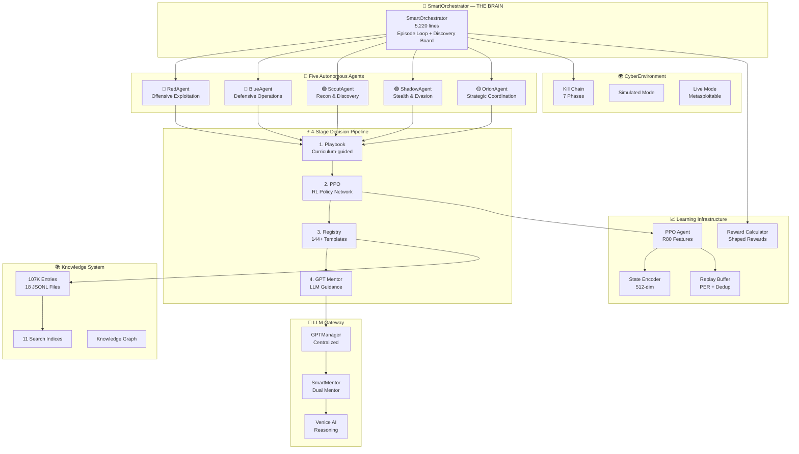
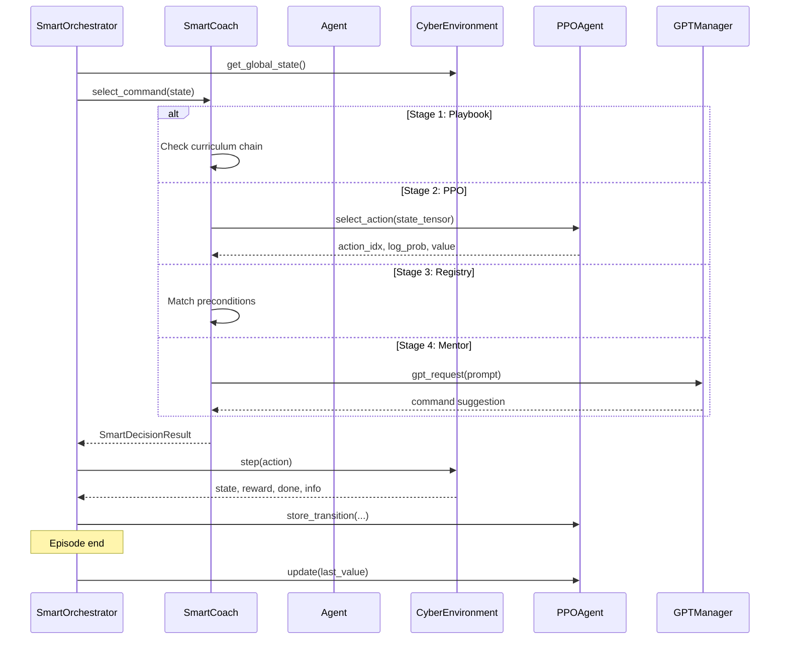
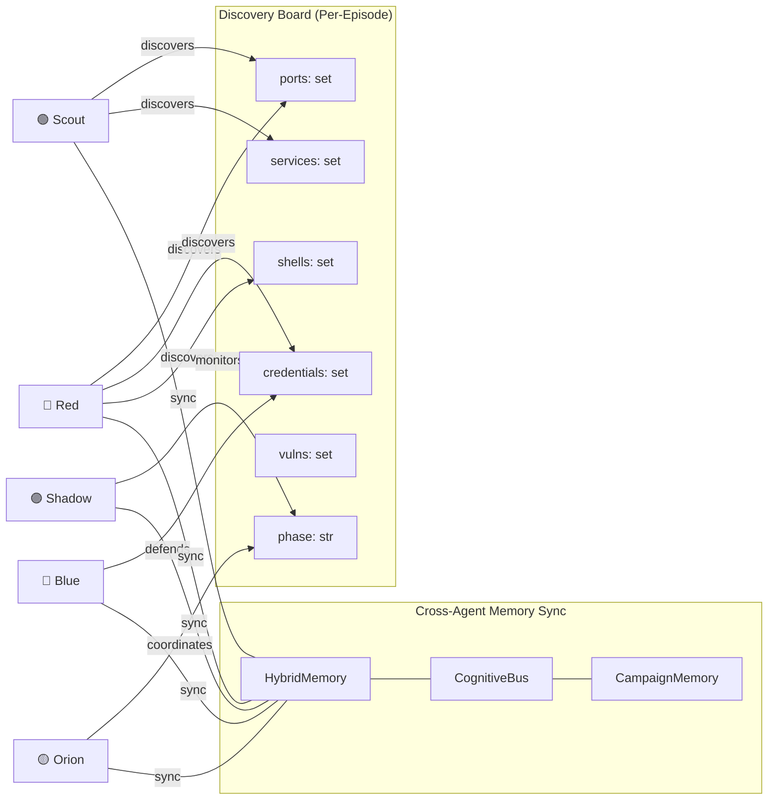
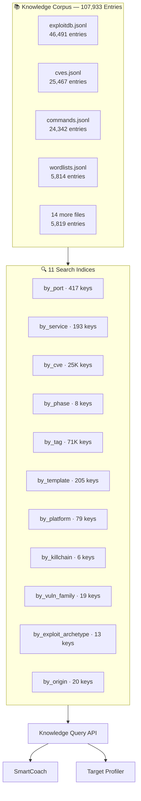

<p align="center">
  
  
  
  
  
</p>

<br>

```
     █████╗ ██████╗ ██╗ █████╗ ███████╗██╗  ██╗ █████╗
    ██╔══██╗██╔══██╗██║██╔══██╗██╔════╝██║ ██╔╝██╔══██╗
    ███████║██████╔╝██║███████║███████╗█████╔╝ ███████║
    ██╔══██║██╔══██╗██║██╔══██║╚════██║██╔═██╗ ██╔══██║
    ██║  ██║██║  ██║██║██║  ██║███████║██║  ██╗██║  ██║
    ╚═╝  ╚═╝╚═╝  ╚═╝╚═╝╚═╝  ╚═╝╚══════╝╚═╝  ╚═╝╚═╝  ╚═╝
            ██████╗ ██╗
            ██╔══██╗██║          Autonomous Multi-Agent
            ██████╔╝██║          Reinforcement Learning for
            ██╔══██╗██║          Cybersecurity Simulation
            ██║  ██║███████╗
            ╚═╝  ╚═╝╚══════╝     by Filip Volf
```

<p align="center">
  <strong>5 Autonomous Agents · PPO + GPT Hybrid · 107K Knowledge Entries · Kill Chain Simulation</strong>
</p>

---

## What Is Ariaska?

Ariaska_RL is an autonomous multi-agent reinforcement learning system designed for cybersecurity simulation and penetration testing research. Five specialized AI agents coordinate through a GPT-hybrid decision pipeline to learn offensive and defensive security strategies across a full kill chain — from reconnaissance through exfiltration.

The system combines PPO-based reinforcement learning with LLM guidance (GPT mentor) in a novel 4-stage decision pipeline, backed by a 107K-entry cybersecurity knowledge corpus and 11 prebuilt search indices.

### At a Glance

```
┌──────────────────────────────────────────────────────────────────────┐
│                          ARIASKA_RL                                  │
│                                                                      │
│   86,000+ lines of core Python    ·    165 modules                   │
│   423 tests (all passing)         ·    18 test files                 │
│   107,933 knowledge entries       ·    11 search indices             │
│   5 specialized agents            ·    144+ command templates        │
│   7 kill chain phases             ·    PPO with R80 features         │
│                                                                      │
│   Primary Target:  Metasploitable 2/3 via Docker                     │
│   Entry Point:     ariaska_cli.py → SmartOrchestrator                │
│   Python:          3.11+ (developed on 3.13.7)                       │
└──────────────────────────────────────────────────────────────────────┘
```

---

## Table of Contents

- [What Is Ariaska?](#what-is-ariaska)
  - [At a Glance](#at-a-glance)
- [Table of Contents](#table-of-contents)
- [Architecture](#architecture)
  - [Data Flow — One Training Step](#data-flow--one-training-step)
- [The Five Agents](#the-five-agents)
  - [Agent Communication](#agent-communication)
- [Decision Pipeline](#decision-pipeline)
- [Kill Chain Simulation](#kill-chain-simulation)
  - [Discovery Rewards](#discovery-rewards)
  - [Primary Target: Metasploitable 2](#primary-target-metasploitable-2)
- [Knowledge System](#knowledge-system)
- [PPO — Primary RL Algorithm](#ppo--primary-rl-algorithm)
  - [State Encoder — 512 Dimensions](#state-encoder--512-dimensions)
- [Reward System](#reward-system)
- [Quick Start](#quick-start)
  - [Prerequisites](#prerequisites)
  - [Installation](#installation)
  - [First Training Run](#first-training-run)
  - [With Metasploitable (Docker)](#with-metasploitable-docker)
- [Training Modes](#training-modes)
  - [CLI Reference](#cli-reference)
  - [Makefile Shortcuts](#makefile-shortcuts)
- [Project Structure](#project-structure)
- [Testing](#testing)
  - [Test Architecture](#test-architecture)
- [Configuration](#configuration)
  - [Environment Variables](#environment-variables)
  - [Key Hyperparameters](#key-hyperparameters)
- [Parser Broker — 4-Stage Output Processing](#parser-broker--4-stage-output-processing)
- [Security \& Safety](#security--safety)
- [Author](#author)
- [License](#license)

---

## Architecture



### Data Flow — One Training Step



---

## The Five Agents

Ariaska deploys five specialized agents that activate in phase-dependent order. Each implements `AgentInterface` and `MemorySyncInterface`.

```
┌─────────────────────────────────────────────────────────────────────┐
│                    AGENT ACTIVATION ORDER                            │
│                                                                     │
│  RECON Phase:                                                       │
│    Scout ──▶ Shadow ──▶ Orion ──▶ Red ──▶ Blue                      │
│                                                                     │
│  EXPLOITATION Phase:                                                │
│    Red ──▶ Shadow ──▶ Scout ──▶ Orion ──▶ Blue                      │
│                                                                     │
│  EXFILTRATION Phase:                                                │
│    Red ──▶ Shadow ──▶ Orion ──▶ Scout ──▶ Blue                      │
└─────────────────────────────────────────────────────────────────────┘
```

| Agent | Role | Specialization |
|:------|:-----|:---------------|
| **🔴 RedAgent** | `offensive` | Exploitation, privilege escalation, exfiltration. Primary PPO-trained agent. DQN+GPT hybrid decision making with emergency fallbacks. |
| **🔵 BlueAgent** | `defensive` | Honeypot deployment, credential resets, firewall management, alert triage. Reactive defense. |
| **🟢 ScoutAgent** | `recon` | Network discovery, port scanning, service fingerprinting, version detection. Eyes of the operation. |
| **🟣 ShadowAgent** | `stealth` | Alert monitoring, scan timing optimization, detection avoidance, action overrides. Keeps the team invisible. |
| **🟡 OrionAgent** | `strategic` | Cross-agent coordination, strategic reviews, directive protocols, phase transitions. The strategist. |

### Agent Communication



---

## Decision Pipeline

Each agent's `SmartCoach` selects commands through a 4-stage hybrid pipeline:

```
┌───────────────┐     ┌──────────────┐     ┌───────────────┐     ┌──────────────┐
│  1. PLAYBOOK  │────▶│   2. PPO     │────▶│  3. REGISTRY  │────▶│  4. MENTOR   │
│               │     │              │     │               │     │              │
│ Curriculum-   │     │ RL Policy    │     │ Precondition- │     │ GPT / Venice │
│ guided chain  │     │ Network      │     │ matched       │     │ LLM fallback │
│               │     │              │     │               │     │              │
│ 60% → 10%    │     │ action_dim=5 │     │ 144+ cmds     │     │ Rate-limited │
│ (annealing)   │     │              │     │               │     │ (annealing)  │
└───────────────┘     └──────────────┘     └───────────────┘     └──────────────┘
                                │
                    ┌───────────▼───────────┐
                    │   ANTI-REPEAT GUARD   │
                    │                       │
                    │ • Blocks exact dupes  │
                    │ • Blocks prefix >3x   │
                    │ • Injects alternative │
                    └───────────────────────┘
```

**Decision source tracking**: Every command is tagged with its source — `"playbook"` | `"ppo"` | `"registry"` | `"mentor"` | `"dual_mentor"` | `"anti_repeat"` | `"fallback"` — enabling fine-grained analysis of how the system learns to make its own decisions over time.

---

## Kill Chain Simulation

The `CyberEnvironment` simulates a complete attack lifecycle across 7 phases:


### Discovery Rewards

| Discovery | Reward | Phase Completion | Reward |
|:----------|:-------|:-----------------|:-------|
| Open Port | +2.5 | RECON | +1.0 |
| Service ID | +5.0 | ENUMERATION | +5.0 |
| Version ID | +6.5 | EXPLOITATION | +25.0 |
| Credential | +20.0 | PRIV. ESCALATION | +50.0 |
| Password | +26.0 | LATERAL MOVEMENT | +100.0 |
| Shell | +50.0 | POST-EXPLOIT | +150.0 |
| Root Shell | +130.0 | EXFILTRATION | +250.0 |
| Flag | +200.0 | | |

### Primary Target: Metasploitable 2

```
┌──────────────────────────────────────────────────────────────────┐
│              METASPLOITABLE 2 — ATTACK SURFACE                   │
├────────┬───────────────────┬────────────────────────────────────-─┤
│  Port  │  Service          │  Vulnerability / Exploit Path       │
├────────┼───────────────────┼─────────────────────────────────────-┤
│   21   │  vsftpd 2.3.4     │  Backdoor → root                   │
│   22   │  OpenSSH 4.7p1    │  Weak creds (msfadmin:msfadmin)     │
│ 139/445│  Samba 3.0.20     │  CVE-2007-2447 → root               │
│  1524  │  ingreslock       │  Backdoor → instant root             │
│  3306  │  MySQL 5.0.51a    │  No root password                    │
│  5432  │  PostgreSQL 8.3   │  Default creds → RCE                 │
│  6667  │  UnrealIRCd       │  Backdoor → root                    │
│  8180  │  Tomcat           │  Default creds → WAR deploy → shell  │
│ 512-14 │  rexec/rlogin/rsh │  No auth → remote command exec       │
│  2049  │  NFS              │  World-readable → plant SSH keys     │
│  5900  │  VNC              │  Password: password                  │
└────────┴───────────────────┴─────────────────────────────────────-┘
```

---

## Knowledge System

The knowledge corpus contains **107,933 entries** across 18 JSONL partitions, indexed by 11 dimensions for sub-millisecond query performance.



Each entry follows the `KnowledgeCandidate` v2 schema — 14 nested dataclasses covering taxonomy, evidence gates, execution templates, references (CVEs, MITRE ATT&CK), quality metrics, and governance metadata.

---

## PPO — Primary RL Algorithm

The PPO implementation includes R80-level advanced features for stable, sample-efficient learning:

```
┌─────────────────────────────────────────────────────────────────┐
│                     PPO CONFIGURATION                           │
├──────────────────────┬──────────────────────────────────────────┤
│  State Dimension     │  512 (via RichStateEncoder)              │
│  Action Dimension    │  5 (via CommandActionMapper)             │
│  Hidden Layers       │  [512, 512, 256]                        │
│  Clip Epsilon        │  0.2 (adaptive: 0.15 — 0.25)            │
│  Discount (γ)        │  0.99                                   │
│  GAE Lambda (λ)      │  0.97 (dual: + 0.70 short-horizon)      │
│  Learning Rate       │  3e-4 → 1e-5 (KL-adaptive)             │
│  Epochs/Update       │  4                                      │
│  Minibatch Size      │  16                                     │
│  Rollout Size        │  256                                    │
└──────────────────────┴──────────────────────────────────────────┘
```

**Advanced Features (R68–R80):**

```
  Phase-Gated Actor Heads ──── HRL-Lite: 3 head groups
  Self-Imitation Learning ──── 500-entry SIL buffer
  Symlog Value Compression ─── DreamerV3-style
  Cosine Entropy Schedule ──── With rebound
  Dual-Horizon GAE ─────────── λ=0.97 long + λ=0.70 short
  EMA Target Network ──────── τ=0.995 + value-surprise bonus
  Spectral Normalization ───── On critic network
  Soft Advantage Clipping ──── Tanh-based
  Auxiliary Phase Prediction ─ Multi-task head
  Adaptive Clip Scheduling ─── From rolling clip_fraction
  KL-Adaptive Learning Rate ── Auto-anneal on KL divergence
  Gradient Accumulation ────── 2× effective batch
  Per-Phase Advantage Whitening
  Prioritized Advantage Sampling
```

### State Encoder — 512 Dimensions

```
┌─────────┬─────────────────────────────────────────────┐
│ Dims    │ Content                                     │
├─────────┼─────────────────────────────────────────────┤
│  0 – 11 │ Phase one-hot + progress (12)               │
│ 12 – 26 │ State flags: ports, shell, creds... (15)    │
│ 27 – 46 │ Top 20 port indicators (20)                 │
│ 47 – 58 │ Service type presence (12)                  │
│ 59 – 70 │ Numeric: risk, alerts, scores... (12)       │
│ 71 – 80 │ Action history encoding (10)                │
│ 81 – 85 │ LLM/Mentor features (5)                    │
│ 86 – 90 │ Temporal features (5)                       │
│ 91 –511 │ Reserved (421)                              │
└─────────┴─────────────────────────────────────────────┘
```

---

## Reward System

Ariaska uses shaped rewards to guide agent learning, with careful calibration to prevent reward hacking:

```
       Reward Multiplier: 1.0 (honest — no inflation)
       Reward Floor:     -5.0 (prevents catastrophic penalties)
       Redundancy:        Soft penalty, max 0.5

  ┌─────────────────────────────────────────────────────────┐
  │              REWARD-INVARIANT METRICS                    │
  │                                                         │
  │  These measure REAL learning, not reward gaming:         │
  │                                                         │
  │  • unique_commands ──── distinct commands per episode    │
  │  • diversity_ratio ──── unique / total steps             │
  │  • total_discoveries ── genuinely new findings           │
  │  • step_at_first_exploit ── speed to exploitation        │
  │  • completion_bonus ── reached EXFILTRATION?             │
  └─────────────────────────────────────────────────────────┘
```

---

## Quick Start

### Prerequisites

- Python 3.11+ (developed on 3.13.7)
- ~4GB disk space (knowledge corpus + models)
- OpenAI API key (optional — system works offline with degraded mentor)

### Installation

```bash
# Clone
git clone https://github.com/Reckless98/Ariaska_RL.git
cd Ariaska_RL

# Create virtual environment
python -m venv .venv
source .venv/bin/activate

# Install dependencies
pip install -r requirements.txt

# (Optional) Configure API key for GPT mentor
echo "OPENAI_API_KEY=sk-..." > .env
```

### First Training Run

```bash
# Simulated environment — no external dependencies
python ariaska_cli.py smart-train --episodes 10 --steps 40 --env sim

# Quick smoke test (3 episodes)
make smoke

# Full training run
make train
```

### With Metasploitable (Docker)

```bash
# Start Metasploitable 2 target
docker-compose -f docker-compose.metasploitable.yml up -d

# Train against live target
python ariaska_cli.py smart-train --env msf --target 172.28.0.10 --episodes 100
```

---

## Training Modes

| Mode | Command | Target | Description |
|:-----|:--------|:-------|:------------|
| **Simulation** | `--env sim` | Virtual | Safe, fast, no external deps. Domain-randomized. |
| **Metasploitable 2** | `--env msf --target 172.28.0.10` | Docker | Real vulnerable VM, 11+ exploitable services. |
| **Metasploitable 3** | `--env msf --target 172.28.0.11` | Docker | Modern target, more complex attack surface. |
| **Offline** | `OPENAI_API_KEY` unset | Any | No LLM calls. PPO + Registry + Playbook only. |

### CLI Reference

```bash
python ariaska_cli.py smart-train \
    --episodes 100        # Number of training episodes
    --steps 40            # Max steps per episode
    --seed 42             # Reproducible results
    --env sim             # Environment: sim | msf
    --target 172.28.0.10  # Target IP for live mode

python ariaska_cli.py status        # Show training status
python ariaska_cli.py help          # Full help
```

### Makefile Shortcuts

```bash
make venv          # Create virtual environment
make train         # Full training (100 episodes)
make train-quick   # Quick run (10 episodes)
make train-msf     # Train against Metasploitable
make smoke         # 3-episode smoke test
make test          # Run all 423 tests
make last          # Show last run results
make clean         # Clean artifacts
```

---

## Project Structure

```
ariaska_cli.py                              # CLI entry point
core/
├── orchestration/
│   ├── smart_orchestrator.py    (5,220L)   # THE BRAIN — episode loop
│   └── orchestrator.py                     # Base orchestrator
├── agents/
│   ├── red_agent.py             (2,204L)   # 🔴 Offensive agent
│   ├── blue_agent.py                       # 🔵 Defensive agent
│   ├── scout_agent.py                      # 🟢 Recon agent
│   ├── shadow_agent.py           (711L)    # 🟣 Stealth agent
│   ├── orion_agent.py                      # 🟡 Strategic agent
│   └── enhanced_agent_base.py              # Shared mixin
├── training/
│   ├── smart_coach.py           (6,542L)   # 4-stage decision pipeline
│   └── mentor_policy.py                    # Mentor call annealing
├── algorithms/
│   ├── ppo_agent.py             (1,454L)   # PPO with R80 features
│   ├── command_action_mapper.py            # Action ↔ Command mapping
│   ├── replay_buffer.py                    # PER + deduplication
│   ├── sac_agent.py                        # Soft Actor-Critic (alt)
│   └── rnd_curiosity.py                    # RND intrinsic motivation
├── environment/
│   ├── cyber_environment.py     (2,854L)   # Kill chain simulation
│   └── metasploitable_handler.py           # Docker integration
├── commands/
│   ├── command_registry.py      (3,507L)   # 144+ CommandTemplates
│   └── command_enrichment.py               # Knowledge enrichment
├── knowledge/
│   ├── knowledge_candidate_v2.py (329L)    # Schema (14 dataclasses)
│   ├── knowledge_packs.py      (2,468L)    # Pre-built packs
│   ├── target_profiler.py      (1,422L)    # Target resolution
│   └── pentesting_playbooks.py (1,013L)    # Playbook chains
├── llm/
│   ├── smart_mentor.py          (1,386L)   # Dual mentor (GPT+Venice)
│   └── reward_calculator.py      (796L)    # Shaped reward system
├── execution/
│   ├── parser_broker.py          (291L)    # 4-stage output parser
│   ├── live_executor.py          (410L)    # Real command execution
│   └── sandboxed_executor.py               # Safety wrapper
├── memory/
│   ├── hybrid_memory.py                    # Short + long term
│   ├── enhanced_memory_sync.py             # Cross-agent fusion
│   └── campaign_memory.py                  # Persistent memory
├── models/
│   ├── state_encoder.py          (438L)    # 512-dim encoder
│   └── advanced_networks.py                # Attention + NoisyNet
├── gpt_manager.py               (1,175L)   # LLM gateway (ALL calls)
├── testing/
│   ├── fake_gpt_manager.py                 # Deterministic mock
│   └── tool_runner.py                      # Stub/Real tool runner
└── ui/                                     # Textual TUI dashboard

data/
├── knowledge_candidates_v2/                # 107,933 entries (18 JSONL)
├── knowledge_indices/                      # 11 prebuilt indices
└── knowledge_retriever.py                  # Query API

tests/                                      # 18 files, 423 tests
```

---

## Testing

```bash
# Full suite (423 tests)
make test
# or
pytest tests/ -v --tb=short

# Quick smoke test
make smoke

# Specific test file
pytest tests/test_phase3_invariants.py -v
```

### Test Architecture

| Test File | Coverage |
|:----------|:---------|
| `test_phase0_invariants` | GPTManager, agent initialization, interfaces |
| `test_phase2_invariants` | Metasploitable, sandboxed execution, discovery |
| `test_phase3_invariants` | State encoder, PPO, playbooks, command registry |
| `test_smart_integration` | SmartOrchestrator, dashboard, command rendering |
| `test_training_smoke` | Full end-to-end training pipeline |
| `test_phase62_systems` | Phase 6.2 subsystems |
| `test_phase63_components` | Phase 6.3 components |
| `test_phase93_components` | Phase 9.3 components |
| `test_phase95_correctness` | Phase 9.5 correctness validation |
| `test_phase97_telemetry` | Telemetry and tracing |
| `test_cloud_roles` | Cloud LLM role definitions |

All tests use `FakeGPTManager` (deterministic, no API calls) and `StubToolRunner` (tracks commands without execution).

---

## Configuration

### Environment Variables

| Variable | Purpose |
|:---------|:--------|
| `OPENAI_API_KEY` | GPT mentor access (absent → offline mode) |
| `ARIASKA_DRY_RUN=1` | Prevent real command execution |
| `PYTHONPATH` | Should include project root |

### Key Hyperparameters

| Parameter | Value | Location |
|:----------|:------|:---------|
| State dimension | 512 | `state_encoder.py` |
| Action dimension | 5 | `PPOConfig` |
| PPO clip epsilon | 0.2 (adaptive) | `PPOConfig` |
| Steps/episode | 40 | `SmartOrchestratorConfig` |
| Mentor anneal | 60% → 10% | `MentorPolicy` |
| Mentor budget | 30% of steps | `SmartOrchestratorConfig` |
| Reward multiplier | 1.0 | `SmartRewardCalculator` |

---

## Parser Broker — 4-Stage Output Processing

Command outputs are parsed through a cascading 4-stage pipeline:

```
  Raw Output
      │
      ▼
  ┌─────────┐     ┌─────────┐     ┌─────────┐     ┌─────────┐
  │  REGEX  │────▶│   SOP   │────▶│ VENICE  │────▶│   GPT   │
  │         │     │         │     │         │     │         │
  │ Pattern │     │ Standard│     │ AI for  │     │ Final   │
  │ matching│     │ rules   │     │ ambiguity│    │ classify│
  └─────────┘     └─────────┘     └─────────┘     └─────────┘
      │                                                │
      ▼                                                ▼
  DiscoveryEvent ─────────────────────────────── DiscoveryEvent
```

---

## Security & Safety

```
  ⚠️  This software is for AUTHORIZED TESTING ONLY

  Built-in safeguards:
  ├── RFC1918 IP validation — RealToolRunner only allows private IPs
  ├── Blocked commands list — prevents destructive operations
  ├── DRY_RUN mode — ARIASKA_DRY_RUN=1 prevents real execution
  ├── Sandboxed executor — additional safety layer
  ├── LLM output sanitization — all GPT outputs sanitized
  ├── StubToolRunner — tests never execute real commands
  └── Deterministic mode — --seed for reproducibility
```

---

## Author

**Filip Volf** — Design, architecture, and implementation.

---

## License

**Source Available — Non-Commercial Use Only**

Copyright (c) 2024-2026 Filip Volf. All rights reserved.

This software is available for viewing, study, and non-commercial use. Commercial use, SaaS deployment, and redistribution for profit require a separate license. See [LICENSE](LICENSE) for full terms.

Academic researchers and students may use this software freely for coursework, published research (with citation), and university CTF competitions.

---

<p align="center">
  <sub>Built with obsessive attention to detail. 86K+ lines of core Python. Every line intentional.</sub>
</p>
