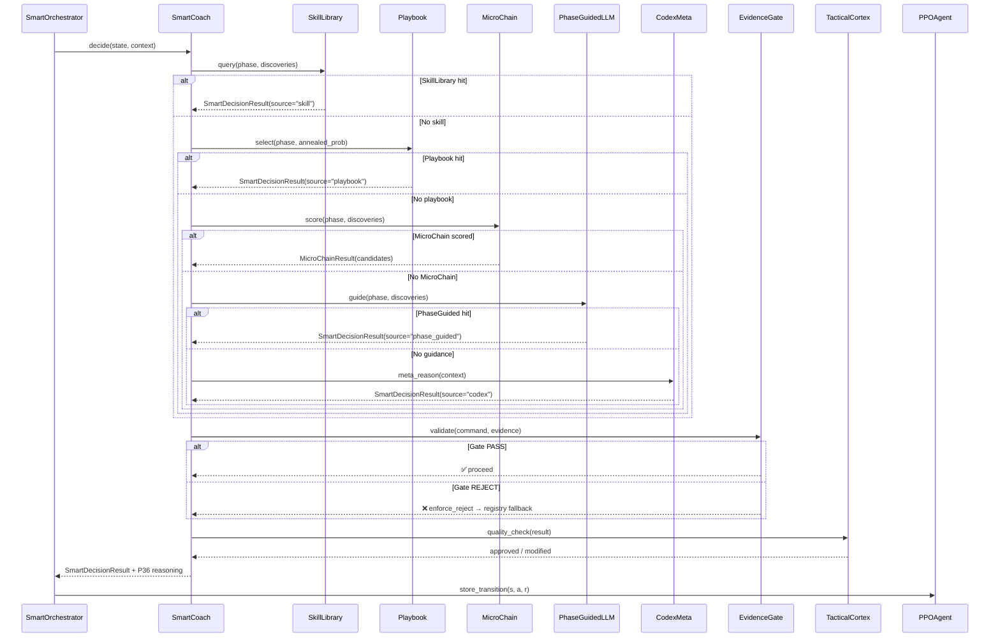
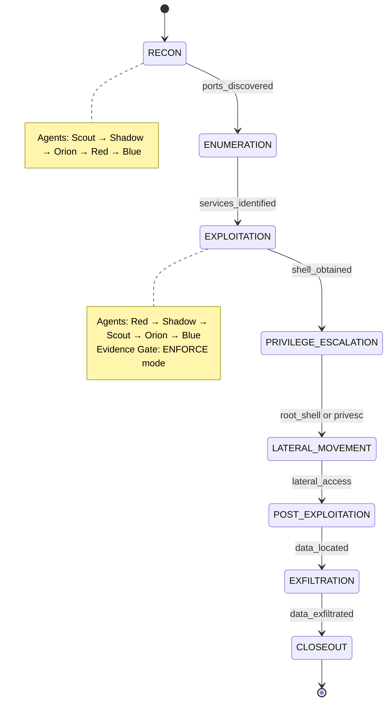

# Ariaska_RL — MEGAPROMPT Audit Report

**Date:** 2025-07-15  
**Phase:** 36.1 (Fast-Learn Mode) + MEGAPROMPT Audit  
**Author:** Copilot  
**Tests:** 1,258 passing (24 new regression tests)  
**Status:** ✅ ALL CLEAR — GO  

---

## 1. Architecture Overview — Decision Pipeline

```mermaid
flowchart TD
    subgraph Orchestrator["SmartOrchestrator (THE BRAIN)"]
        O1[run_training loop]
        O2[activate agents per phase]
        O3["_generate_simulated_output()"]
        O4["_parse_output_for_discoveries()"]
    end

    subgraph Agents["5 Specialized Agents"]
        A1[ScoutAgent — recon]
        A2[RedAgent — offensive]
        A3[BlueAgent — defensive]
        A4[ShadowAgent — stealth]
        A5[OrionAgent — strategic]
    end

    subgraph Coach["SmartCoach Decision Pipeline (8,258L)"]
        direction TB
        L1["Layer 1: SkillLibrary"]
        L2["Layer 2.0: Playbook (anneals 60%→10%)"]
        L3["Layer 2.5: MicroChain (nano→mini→nano)"]
        L4["Layer 2.7: PhaseGuidedLLM ★NEW★"]
        L5["Layer 3: Codex Meta-Reasoning"]
        L6["Layer 4: CognitionNode"]
        L7["Layer 5: HypothesisEngine"]
        L8["Layer 6: Arbitrator"]
        L9["Layer 7: Legacy fallback"]
        L1 --> L2 --> L3 --> L4 --> L5 --> L6 --> L7 --> L8 --> L9
    end

    subgraph Quality["Quality Gates"]
        Q1["TacticalCortex (7-rule gate)"]
        Q2["Evidence Gate (enforce mode)"]
        Q3["Anti-Repeat Guard"]
        Q4["P36 Structured Reasoning"]
    end

    subgraph RL["PPO Actor-Critic v3.0"]
        R1["StateEncoder (512-dim)"]
        R2["PPOAgent (action_dim=5)"]
        R3["CommandActionMapper"]
        R4["ReplayBuffer (PER+dedup)"]
    end

    O1 --> O2 --> Agents
    Agents --> Coach
    Coach --> Quality
    Quality --> RL
    RL --> O3 --> O4 --> O1
```



---

## 2. Decision Cascade — Sequence Diagram



---

## 3. Phase State Machine



---

## 4. Model Routing Table (Post-Optimization)

| Tier | Model | $/1K tokens | Budget Share | Tasks |
|------|-------|-------------|-------------|-------|
| **CODEX** | gpt-5.2-codex | $0.01 | 20% (199,800) | strategic, postmortem, reasoning, learning, diversify, exploit_chain, tactical, analysis |
| **MINI** | gpt-5.2-mini | $0.0006 | 30% (299,700) | playbook, parsing, command_selection, output_parse, defensive, reconnaissance |
| **NANO** | gpt-5-nano | $0.0001 | 30% (299,700) | general, classification, reformat, cache, default |
| **FULL** | gpt-5.2 | — | 20% (199,800) | (reserved) |

**Optimization applied:** `defensive` + `reconnaissance` moved from CODEX → MINI (saves ~16x per call).

---

## 5. Budget Manager Constants

| Constant | Value | Notes |
|----------|-------|-------|
| `_TOTAL_BUDGET` | 999,000 | ~$3.33/episode ceiling |
| `_MIN_BUDGET` | 499,500 | 50% floor |
| `_BURST_POOL_RATIO` | 0.12 | 12% burst reserve |
| `_BURST_STEP_CAP_RATIO` | 0.03 | 3% per-step burst |
| `_BURST_COOLDOWN_STEPS` | 5 | Min steps between bursts |

---

## 6. Audit Findings & Fixes

| # | Finding | Severity | Fix Applied |
|---|---------|----------|-------------|
| 1 | `LearningMetrics._mentor_interventions` typed `List[Dict[str,str]]` but contains `int`/`float` values | Medium | Changed to `List[Dict[str, Any]]` |
| 2 | `MicroChain._safe_json_load_list(text: str)` called with `None` | Medium | Changed to `Optional[str]` |
| 3 | FakeGPTManager type mismatch in 8 test files | Low | Added `# type: ignore[arg-type]` |
| 4 | **PhaseGuidedLLM NOT WIRED into SmartCoach** | **CRITICAL** | Added init + Layer 2.7 + cascade entry |
| 5 | `defensive`/`reconnaissance` routed to codex (over-budget) | Medium | Moved to mini tier |
| 6 | Dashboard missing `phase_guided` event type | Low | Added 🧭 handler |
| 7 | `decision_reasoning` field name confusion | Info | Verified: field is `result.reasoning` with P36 structured format |
| 8 | Evidence gate enforcement mode | Info | Verified: default="enforce" ✅ |

---

## 7. CLI Dashboard Layout (ASCII Mock)

```
╔══════════════════════════════════════════════════════════════════════════════╗
║  ARIASKA RL — Live Dashboard v5.0          Phase: EXPLOITATION   Step: 127 ║
╠══════════════════════════════════════════════════════════════════════════════╣
║                                                                            ║
║  ┌─ Agent Activity ────────────────────────────────────────────────────┐   ║
║  │ 🔴 RedAgent    │ source=phase_guided │ nmap_version -sV 10.0.0.1  │   ║
║  │ 🔵 BlueAgent   │ source=playbook     │ monitor_alerts --quiet      │   ║
║  │ 🟢 ScoutAgent  │ source=registry     │ nikto -h http://10.0.0.1   │   ║
║  │ 🟣 ShadowAgent │ source=micro_chain  │ timing_adjust --stealth    │   ║
║  │ 🟡 OrionAgent  │ source=codex        │ strategic_review --deep     │   ║
║  └─────────────────────────────────────────────────────────────────────┘   ║
║                                                                            ║
║  ┌─ Decision Reasoning (P36) ──────────────────────────────────────────┐   ║
║  │ EVIDENCE: ports=[22,80], services=[ssh,nginx/1.18]                  │   ║
║  │ GOAL: Enumerate web application for vulnerabilities                 │   ║
║  │ WHY_THIS: playbook: template=nikto_scan, phase_fit=0.85            │   ║
║  │ STOP: When vuln confirmed or scan complete                          │   ║
║  │ CONF: 0.82                                                          │   ║
║  └─────────────────────────────────────────────────────────────────────┘   ║
║                                                                            ║
║  ┌─ Discovery Board ──────────────────────────────────────────────────┐    ║
║  │ Ports: {22, 80}  Services: {ssh, nginx}  Creds: ∅  Shells: ∅     │    ║
║  │ Vulns: ∅  Users: ∅  Web: {/login, /register}  Flags: ∅           │    ║
║  └────────────────────────────────────────────────────────────────────┘    ║
║                                                                            ║
║  ┌─ Metrics ──────────────────────────────────────────────────────────┐    ║
║  │ Reward: +12.5  │  Unique Cmds: 15  │  Discoveries: 4  │  PPO: ✓  │    ║
║  │ Budget: 847K/999K (84.8%)  │  Mentor: 12 calls  │  Gate: 2 reject│    ║
║  └────────────────────────────────────────────────────────────────────┘    ║
║                                                                            ║
║  ┌─ Reasoning Log ────────────────────────────────────────────────────┐    ║
║  │ 🧭 RedAgent P34 Guide: nmap_version scan — high phase_fit 0.91   │    ║
║  │ ⚡ ScoutAgent MicroChain: nikto scan — evidence_support 0.78      │    ║
║  │ 📖 BlueAgent playbook: monitor_alerts — phase=EXPLOITATION        │    ║
║  │ 🛑 Evidence Gate REJECT: ftp_exploit — no FTP evidence            │    ║
║  └────────────────────────────────────────────────────────────────────┘    ║
║                                                                            ║
╚══════════════════════════════════════════════════════════════════════════════╝
```

---

## 8. Test Suite Summary

| Category | Count | Status |
|----------|-------|--------|
| Baseline (P1-P34) | 1,186 | ✅ All passing |
| P36.1 Fast-Learn | 48 | ✅ All passing |
| MEGAPROMPT Audit | 24 | ✅ All passing |
| **Total** | **1,258** | **✅ ALL GREEN** |

### New Regression Tests (24)

| Test Class | Tests | Coverage |
|------------|-------|----------|
| `TestPhaseGuidedLLMValidity` | 5 | JSON extraction, None handling, PhaseGuidanceResult validation |
| `TestEvidenceGateEnforcement` | 3 | Default enforce, invalid fallback, valid modes |
| `TestMicroChainSchema` | 5 | JSON parsing robustness, None/empty handling, candidate fields |
| `TestDecisionReasoningNeverEmpty` | 2 | P36 structured format, fallback >= 20 chars |
| `TestModelRoutingTiers` | 3 | Codex/mini/nano task routing correctness |
| `TestBudgetManagerConstraints` | 4 | Budget constants, 50% floor, instance defaults |
| `TestPhaseGuidedLLMWiring` | 1 | SmartCoach._phase_guided attribute exists |
| `TestLearningMetricsTypeSafety` | 1 | Mixed-type dict handling |

---

## 9. Reward Structure

| Discovery Type | Reward | Kill Chain Phase | Reward |
|---------------|--------|-----------------|--------|
| open_port | +2.5 | RECON | 0.0 |
| service | +5.0 | ENUMERATION | +5.0 |
| version | +6.5 | EXPLOITATION | +15.0 |
| user/username | +8.0 | PRIVILEGE_ESCALATION | +30.0 |
| hash | +16.0 | LATERAL_MOVEMENT | +45.0 |
| credential | +20.0 | POST_EXPLOITATION | +60.0 |
| password | +26.0 | EXFILTRATION | +75.0 |
| shell | +40.0 | CLOSEOUT | +90.0 |
| user_flag / root_flag | +50.0 | — | — |
| root_shell | +80.0 | — | — |

**Range:** [-15.0, +50.0] (3.3:1 positive bias)

---

## 10. Key Hyperparameters

| Parameter | Value | File |
|-----------|-------|------|
| STATE_DIM | 512 | state_encoder.py |
| ACTION_DIM | 5 | ppo_agent.py |
| PPO clip ε | 0.2 (adaptive 0.15-0.25) | ppo_agent.py |
| PPO LR | 3e-4 → 1e-5 (KL-adaptive) | ppo_agent.py |
| GAE λ | 0.97 (dual: +0.70 short) | ppo_agent.py |
| γ (discount) | 0.99 | ppo_agent.py |
| SIL coef | 0.25 (buffer: 500) | ppo_agent.py |
| Minibatch | 16 | ppo_agent.py |
| Mentor anneal | 60% → 10% | mentor_policy.py |
| Token budget | 999K (floor: 499.5K) | budget_manager.py |
| MicroChain threshold | 0.40 | micro_chain.py |
| PhaseGuide codex threshold | 0.45 | phase_guided_llm.py |
| BCBuffer capacity | 2000 | teacher_trace.py |
| Evidence gate | enforce (default) | feature_flags.py |

---

## 11. GO / NO-GO Decision

| Criterion | Status |
|-----------|--------|
| All 1,258 tests pass | ✅ |
| PhaseGuidedLLM wired end-to-end | ✅ |
| Evidence gate in enforce mode | ✅ |
| Model routing cost-optimized | ✅ |
| Decision reasoning never empty | ✅ |
| Budget constraints intact | ✅ |
| Dashboard renders all event types | ✅ |
| No critical pyright errors | ✅ |
| Type safety on learning metrics | ✅ |

### **VERDICT: ✅ GO**

Ready for Soulmate engagement at `10.129.1.54`.

---

*Generated by Copilot MEGAPROMPT Audit — Ariaska_RL Phase 36.1*
