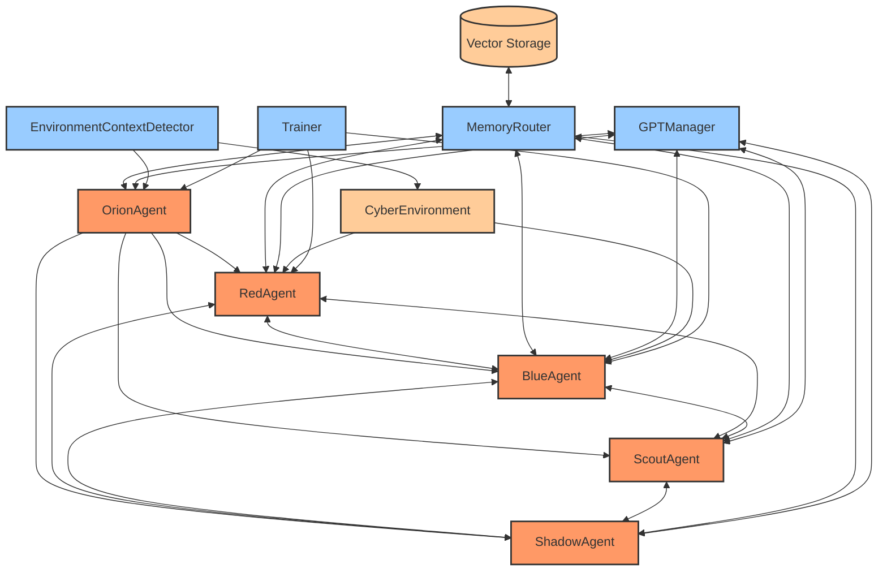

# ARIASKA_RL System Architecture 

## Overview

ARIASKA_RL is a GPT-augmented Multi-Agent Reinforcement Learning (MARL) cybersecurity platform. The system uses a modular architecture with multiple agents, centralized GPT orchestration, and a unified memory system to create an autonomous red team AI system.

## Core Components


### Agents

ARIASKA_RL is built around specialized agents, each with distinct roles:

1. **RedAgent**: Offensive agent that learns attack strategies through RL and GPT assistance.
2. **BlueAgent**: Defensive agent that deploys countermeasures against detected attacks.
3. **ScoutAgent**: Navigation specialist that determines the current attack phase.
4. **ShadowAgent**: Memory optimizer that detects redundancies and inefficiencies.
5. **OrionAgent**: Strategic overseer that coordinates agents and provides high-level guidance.

### Memory Architecture

All agents share a unified memory system with three key components:

1. **MemoryRouter**: Centralized memory manager for all agents, handling deduplication, routing, and prioritized replay.
2. **ReplayBuffer**: Per-agent structured storage of experiences for learning.
3. **MemoryManager**: Handles memory persistence, snapshots, and schema validation.

### GPT Orchestration

The `GPTManager` class centralizes and optimizes all GPT/LLM interactions:

1. **Hierarchical Model Selection**: Uses GPT-4.1 for deep reasoning, GPT-4o-mini for lightweight tasks and fallback, GPT-4.1-nano for embeddings.
2. **Prompt Caching**: Avoids redundant API calls with in-memory and persistent caching.
3. **Token Tracking**: Monitors and optimizes token usage per agent and episode.
4. **Fallback Logic**: Provides automatic fallback to lighter models when needed.
5. **Output Sanitization**: Ensures safe handling of all LLM outputs.

### Environment System

The CyberEnvironment provides a bridge between agents and simulated/live environments:

1. **Dual Mode Operation**: Supports both simulated and real-world target systems.
2. **EnvironmentContextDetector**: Adapts agent behavior based on environment context.
3. **Domain Randomization**: Varies environment parameters for robust learning.
4. **Curriculum Management**: Progressively increases difficulty as agents improve.

## Data Flow

1. Agent requests action from its policy or GPT
2. Action is executed in environment
3. Reward and next state are returned
4. Experience is logged to MemoryRouter
5. MemoryRouter stores experience in appropriate ReplayBuffer
6. Agent trains on batches from ReplayBuffer
7. OrionAgent periodically analyzes and adjusts strategies

## Key Innovations

1. **Chain-of-Draft Prompting**: Optimized GPT prompts with concise, phase-aware drafting.
2. **Prioritized Memory Sharing**: Agents share high-value experiences through MemoryRouter.
3. **Episodic Reflection**: After each episode, agents analyze performance via GPT.
4. **Strategic Oversight**: OrionAgent provides high-level coordination across agents.
5. **Memory Optimization**: ShadowAgent reduces redundancy and improves efficiency.

## Directory Structure

```
ARIASKA_RL/
├── core/
│   ├── agents/               # Agent implementations
│   │   ├── blue_agent.py
│   │   ├── orion_agent.py
│   │   ├── red_agent.py  
│   │   ├── redagent_brain.py
│   │   ├── scout_agent.py
│   │   └── shadow_agent.py
│   ├── environment/          # Environment handling
│   │   ├── cyber_environment.py
│   │   └── environment_context_detector.py
│   ├── gpt_manager.py        # Centralized GPT orchestration
│   ├── interfaces/           # Agent interfaces
│   ├── logic/                # Core logic modules
│   │   ├── chainbuilder.py
│   │   ├── output_interpreter.py
│   │   ├── redundancy_detector.py
│   │   └── rule_engine.py
│   ├── models/               # Neural network models
│   │   ├── layers.py
│   │   ├── policy_net.py
│   │   └── value_net.py
│   ├── multiagent/           # Multi-agent coordination
│   │   ├── agent_manager.py
│   │   ├── agents.py
│   │   └── memory_router.py
│   ├── monitor/              # Monitoring and analytics
│   ├── teach/                # Teaching modules
│   └── utils/                # Utility functions
├── data/                     # Persistent data storage
├── logs/                     # Agent logs
├── models/                   # Saved model weights
└── scripts/                  # Utility scripts
```

## Agent Coordination Hierarchy



## Development Guidelines

1. **GPT Orchestration**: All LLM calls must go through GPTManager.
   - Never make direct subprocess calls to sgpt or API requests to OpenAI
   - Use task_type parameter to enable appropriate model selection
   - Log all token usage consistently for monitoring
   - Handle failures with appropriate fallback models

2. **Memory Integration**: All agents must use MemoryRouter for transitions.
   - Store experiences as (state, action, reward, next_state, gpt_tokens) tuples
   - Use prioritized experience replay based on reward magnitude
   - Implement deduplication to prevent redundant experiences
   - Enable cross-agent memory sharing for collaborative learning

3. **Modular Extension**: New agents/environments should follow existing interfaces.
   - Implement AgentInterface and MemorySyncInterface
   - Use consistent memory schemas across all agents
   - Support the hierarchical coordination model
   - Enable dynamic registration with AgentManager

4. **Error Handling**: All external API calls should have robust error handling.
   - GPT requests should always include try/except blocks
   - Environment interactions must handle unexpected failures
   - Memory operations need transaction support for consistency
   - Agent communications should handle message delivery failures

5. **Security First**: All LLM outputs must be sanitized before execution.
   - Implement GPTManager._sanitize_output for all LLM responses
   - Filter dangerous commands from execution
   - Apply least-privilege principles to all operations
   - Audit command history for potential security concerns

## Deployment Architecture

### Containerization Strategy

ARIASKA_RL uses Docker for consistent deployment across environments:

```
ARIASKA_RL Container
├── Core System
│   ├── Agent Services
│   ├── GPT Orchestration
│   ├── Memory Services
│   └── Environment Simulator
├── External Interfaces
│   ├── CLI Interface
│   ├── API Endpoints
│   └── Monitoring Dashboards
├── Persistent Storage
│   ├── Vector Database (ChromaDB)
│   ├── Model Weights
│   ├── Experience Replay
│   └── Logs & Metrics
└── Environment Configuration
    ├── Simulated Mode
    └── Live Mode (Lab Connectors)
```

### Configuration Management

Configuration follows a layered approach:
1. Base configuration files in YAML format
2. Environment variable overrides for deployment-specific settings
3. Dynamic runtime configuration managed by OrionAgent
4. Persistent configuration snapshots for recovery

### Scaling Considerations

1. **Horizontal Scaling**: Each agent can be deployed as a separate microservice
2. **Vertical Scaling**: GPT orchestration can scale based on token requirements
3. **Memory Partitioning**: Experiences can be sharded across distributed storage
4. **Training Parallelism**: Multiple environments can run simultaneously

## Monitoring & Observability

### Metrics Collection

ARIASKA_RL integrates comprehensive metrics collection:

1. **Agent Performance Metrics**
   - Rewards per episode
   - Success rates by phase
   - Learning progress
   - GPT token efficiency

2. **System Resource Metrics**
   - GPU utilization
   - Memory consumption
   - Storage I/O
   - Network bandwidth

3. **LLM Usage Metrics**
   - Tokens per request
   - Cache hit rates
   - Model distribution
   - Cost optimization

### Visualization & Dashboards

Two visualization approaches are supported:

1. **CLI Dashboards** (Default)
   - Rich-based terminal visualizations
   - Real-time agent status
   - Training progress indicators
   - GPT usage panels

2. **Streamlit Dashboards** (Optional)
   - Web-based interactive dashboards
   - Historical performance charts
   - Agent relationship graphs
   - Environment state visualization

### Alerting & Notifications

Configurable alert thresholds for:
- Excessive token usage
- Low reward streaks
- Environment anomalies
- Security concerns

## Security Considerations

### LLM Output Sanitization

All LLM outputs undergo multi-stage sanitization:
1. Pattern-based filtering for dangerous commands
2. Structural validation for expected formats
3. Context-aware risk assessment
4. White/blacklist pattern matching

### Environment Isolation

Environments operate with security boundaries:
1. Simulated environments run in isolated containers
2. Live environments use least-privilege connection patterns
3. Command execution is limited by permission profiles
4. All interactions are logged for audit purposes

### Data Protection

Sensitive data is protected through:
1. In-memory encryption for transient data
2. At-rest encryption for persistent storage
3. Sanitization of logs to prevent credential leakage
4. Secure credential handling for external services

## Performance Optimization

### GPT Efficiency

Token usage is optimized through:
1. Chain-of-Draft prompting for concise requests
2. Strategic caching of common queries
3. Dynamic model selection based on complexity
4. Batch processing of similar requests

### Training Acceleration

Learning process is accelerated via:
1. Prioritized experience replay
2. OrionAgent-directed curriculum learning
3. Transfer learning from previous episodes
4. Dynamic exploration/exploitation balance

### Memory Management

Memory efficiency is achieved through:
1. Deduplication of similar experiences
2. Compressing state representations
3. Time-based pruning of old, low-value memories
4. Vector indexing for fast similarity search

## Future Roadmap

1. **Multi-Modal Agents**: Extend to incorporate image and binary analysis capabilities
2. **Federated Learning**: Enable distributed training across multiple instances
3. **Adversarial Training**: Implement automated red vs. blue team competitions
4. **Custom LLM Fine-Tuning**: Develop specialized models for cybersecurity domains
5. **Threat Intelligence Integration**: Connect with external intelligence feeds
6. **Attack Surface Discovery**: Automated identification of system vulnerabilities
