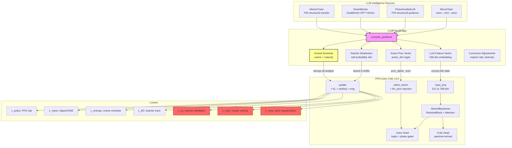
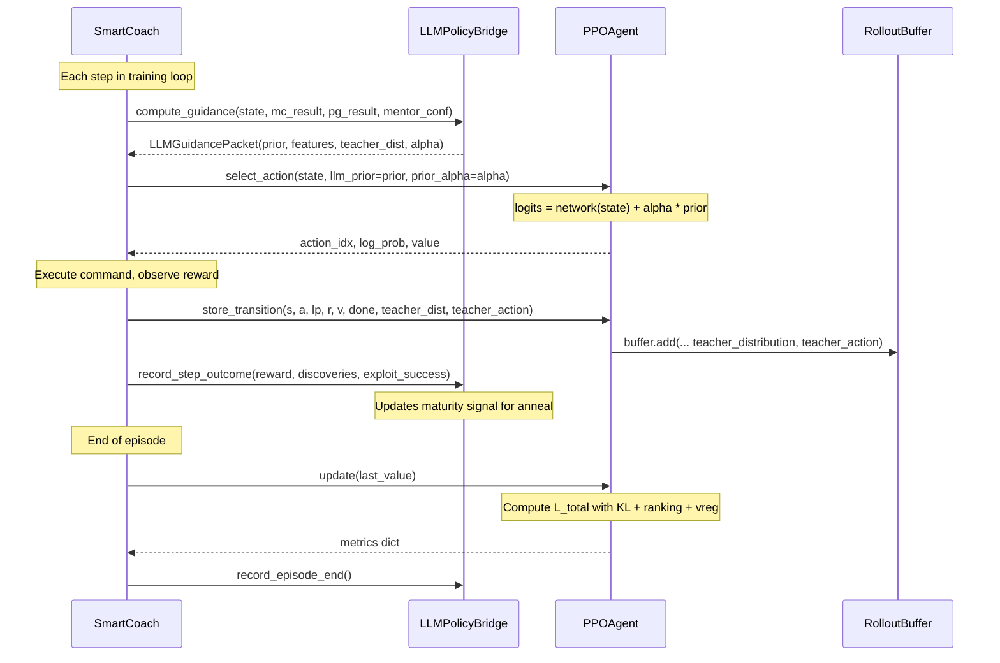
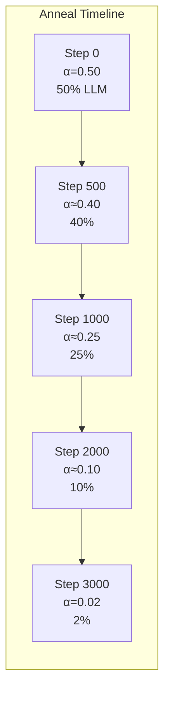

# Phase 37 — Level 5 GPT↔RL Neural Integration

> **Author:** Filip Volf | **Phase:** 37 | **Status:** ACTIVE

## Architecture Overview

Phase 37 implements **Level 5 GPT↔RL Integration** — the deepest possible fusion between LLM intelligence and the PPO reinforcement learning pipeline. LLM knowledge is injected directly into the neural network's:

1. **Policy logits** — via action prior vector injection
2. **State representation** — via 256-dim LLM feature concatenation
3. **Value estimation** — via confidence-augmented value targets
4. **Gradient updates** — via KL teacher distillation + ranking + value regularization losses
5. **Exploration** — via curriculum-driven dynamic shaping

All LLM influence **decays over time** via the teacher anneal schedule, allowing the policy to internalize GPT knowledge and become fully autonomous.

---

## System Architecture



---

## Data Flow



---

## Loss Equation

The total PPO loss with Level 5 auxiliary terms:

$$
L_{\text{total}} = \underbrace{\rho \cdot L_\pi}_{\text{PPO clip}} + \underbrace{c_v \cdot L_V}_{\text{value}} - \underbrace{c_H \cdot H(\pi)}_{\text{entropy}} + \underbrace{c_{\text{phase}} \cdot L_{\text{phase}}}_{\text{aux phase pred}} + \underbrace{c_{\text{bc}} \cdot L_{\text{BC}}}_{\text{teacher trace}} + \underbrace{c_{\text{kl}} \cdot L_{\text{KL}}}_{\text{teacher distill}} + \underbrace{c_{\text{rank}} \cdot L_{\text{rank}}}_{\text{margin ranking}} + \underbrace{c_{\text{vreg}} \cdot L_{\text{vreg}}}_{\text{value reg}}
$$

### Level 5 Auxiliary Losses (New in Phase 37)

**KL Teacher Distillation Loss:**
$$
L_{\text{KL}} = D_{\text{KL}}(\pi_{\text{teacher}} \| \pi_\theta) = \sum_a \pi_{\text{teacher}}(a) \log \frac{\pi_{\text{teacher}}(a)}{\pi_\theta(a)}
$$

**Ranking Margin Loss:**
$$
L_{\text{rank}} = \max\left(0, \; m - \left(f_\theta(s, a^*_T) - \max_{a \neq a^*_T} f_\theta(s, a)\right)\right)
$$
where $a^*_T$ is the teacher's preferred action and $m = 1.0$ is the margin.

**Value Regularization Loss:**
$$
L_{\text{vreg}} = \text{MSE}\left(V_\theta(s), \; V_{\text{target}}\right)
$$
where $V_{\text{target}}$ is derived from the teacher's confidence.

### Loss Coefficient Defaults

| Loss | Coefficient | Anneal | Min |
|------|------------|--------|-----|
| $c_{\text{kl}}$ | 0.15 | cosine + maturity | 0.01 |
| $c_{\text{rank}}$ | 0.05 | proportional to alpha | 0.005 |
| $c_{\text{vreg}}$ | 0.10 | proportional to alpha | 0.01 |

All coefficients decay proportionally to the teacher anneal alpha, ensuring the auxiliary losses shrink alongside the LLM influence.

---

## Teacher Anneal Schedule



The anneal follows a **cosine decay with maturity acceleration**:

$$
\alpha(t) = \alpha_{\min} + \frac{\alpha_{\text{init}} - \alpha_{\min}}{2} \left(1 + \cos\left(\pi \cdot \frac{t}{T}\right)\right) \cdot g(M)
$$

where:
- $t$ = current step, $T$ = total anneal steps (3000)
- $\alpha_{\text{init}} = 0.50$, $\alpha_{\min} = 0.02$
- $g(M)$ = maturity gate: accelerates decay when $M > 0.7$, boosts when struggling ($S_r < 0.2$)

**Maturity Signal:**
$$
M = 0.4 \cdot S_r + 0.3 \cdot R_v + 0.2 \cdot D_e + 0.1 \cdot E_s
$$

| Component | Symbol | Description |
|-----------|--------|-------------|
| Success Rate | $S_r$ | Rolling window positive reward fraction |
| Reward Velocity | $R_v$ | Recent reward change rate |
| Discovery Efficiency | $D_e$ | Discoveries per step |
| Exploit Success Rate | $E_s$ | Exploit command success fraction |

---

## LLM Feature Vector Layout (256-dim)

| Dims | Content | Source |
|------|---------|--------|
| 0–4 | Phase encoding | SmartCoach phase |
| 5–9 | MicroChain signals | MicroChainResult scores |
| 10–14 | Mentor signals | Mentor confidence, call rate |
| 15–19 | Anneal state | Alpha, KL coef, maturity |
| 20–24 | Exploration signals | Diversity pressure, burst |
| 25–29 | Risk estimate | Detection risk, alert level |
| 30–34 | Prior summary | Action prior statistics |
| 35–39 | Temporal features | Step/episode progress |
| 40–255 | Reserved | Future expansion |

---

## Ablation Protocol

Toggle via feature flag or environment variable:

```bash
# Disable Level 5 (ablation baseline)
FF_LLM_POLICY_BRIDGE=0 python ariaska_cli.py smart-train --target 10.129.1.54

# Enable Level 5 (default)
FF_LLM_POLICY_BRIDGE=1 python ariaska_cli.py smart-train --target 10.129.1.54
```

**Programmatic toggle:**
```python
bridge.set_enabled(False)  # → all priors zero, losses zero, features zero
```

**Ablation Delta Metrics** (compare ON vs OFF):
- Unique commands per episode
- Step-to-first-exploit
- Total discoveries
- Reward velocity
- Diversity ratio

---

## File Map

| File | Lines | Role |
|------|-------|------|
| `core/llm/llm_policy_bridge.py` | 775 | Central bridge: guidance packets, anneal, maturity |
| `core/algorithms/ppo_agent.py` | 1736 | PPO with Level 5: prior inject, KL/rank/vreg losses |
| `core/models/state_encoder.py` | 693 | State constants: STATE_DIM, LLM_FEATURE_DIM, ENHANCED_STATE_DIM |
| `core/training/smart_coach.py` | 8355 | Wiring: bridge init, guidance compute, trajectory storage |
| `core/observability/live_dashboard.py` | 2434 | GPT↔RL integration panel |
| `core/feature_flags.py` | 321 | `llm_policy_bridge` flag (FF_LLM_POLICY_BRIDGE) |
| `core/orchestration/smart_orchestrator.py` | 7060 | Dashboard snapshot wiring |
| `tests/test_p37_level5_integration.py` | 390 | 36 design acceptance tests |

---

## Configuration

### PPOConfig Level 5 Fields

| Field | Default | Description |
|-------|---------|-------------|
| `llm_feature_dim` | 0 | LLM feature dims (0=disabled, 256=Level 5) |
| `use_llm_prior` | False | Enable LLM prior injection into logits |
| `prior_alpha_init` | 0.50 | Initial LLM prior weight |
| `use_kl_teacher_loss` | False | Enable KL teacher distillation loss |
| `kl_teacher_coef` | 0.15 | KL loss coefficient |
| `use_ranking_loss` | False | Enable ranking margin loss |
| `ranking_loss_coef` | 0.05 | Ranking loss coefficient |
| `ranking_margin` | 1.0 | Margin for ranking loss |
| `use_value_reg_loss` | False | Enable value regularization loss |
| `value_reg_coef` | 0.10 | Value reg coefficient |

All Level 5 features default to **OFF** for backward compatibility. They are enabled automatically when `LLMPolicyBridge` initializes in `SmartCoach.__init__()`.
